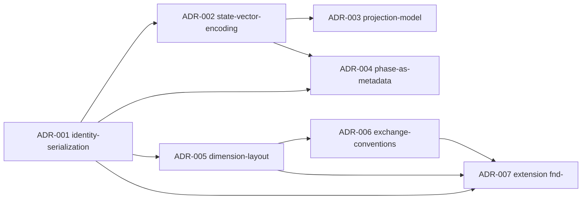

# Ringkasan Implementation ADR

Indeks 7 Implementation ADR dari Reference Implementation EKA v1.0. Seluruh ADR berstatus **accepted** (`content-state: accepted`) dan dimiliki `namespace: eka-ref-impl`, dimensi `decisions`.

| ADR | Keputusan (satu baris) | Status | File |
|---|---|---|---|
| **ADR-001 — Identity Serialization** | Identity disandikan lengkap di frontmatter (`namespace`, `type`, `id`, `instance-version`, `revision`); filename `<type-token>-<id>[-v<nn>]` adalah proyeksi, dengan tabel 26 token bebas-ambiguitas — menyelesaikan kolisi `mvp-nnn` (EKA 6.4, P3, P9). | accepted | [`adr-001-identity-serialization.md`](decisions/adr-001-identity-serialization.md) |
| **ADR-002 — State Vector Encoding** | Status disandikan sebagai 5 field frontmatter per domain state yang dimiliki (`content-state`, `execution-state`, `planning-state`, `container-state`, `existence-state`); absence = not-applicable; single-writer per field (P6); `change-log` array `{date, domain, from, to, by}`; nilai legacy dipetakan ke nilai kanonik. | accepted | [`adr-002-state-vector-encoding.md`](decisions/adr-002-state-vector-encoding.md) |
| **ADR-003 — Projection Model** | Tabel container dan ticket adalah State Projection (EKA 7.4): ticket ber-State Vector kosong dengan `derives-from: [ctr:<id>]`, header "Generated — State Projection", refresh default on-read (EKA 15.5); proyeksi tidak pernah writer (P6). | accepted | [`adr-003-projection-model.md`](decisions/adr-003-projection-model.md) |
| **ADR-004 — Phase as Metadata** | `phase` menjadi field frontmatter pada artifact `scp-`/`plan-` saja (discovery\|mvp\|milestone\|release\|growth\|maturity\|sunset); phase change = context update yang diotorisasi gate kesiapan (EKA 11.2) dan dicatat di `change-log` dengan `domain: phase`; tidak ada folder phase. | accepted | [`adr-004-phase-as-metadata.md`](decisions/adr-004-phase-as-metadata.md) |
| **ADR-005 — Dimension Layout** | 12 folder knowledge = 12 Knowledge Dimension 1:1 + `operating/` (OS) + `exchange/` (EX); aturan lokasi: artifact knowledge hidup di folder dimensinya, validasi menegakkan `dimension == folder`; artifact operating dikecualikan (EKA 8, P15). | accepted | [`adr-005-dimension-layout.md`](decisions/adr-005-dimension-layout.md) |
| **ADR-006 — Exchange Conventions** | Seam exchange (EKA 13) diwujudkan sebagai `skeleton/docs/exchange/validation.md` (9 aturan validasi) + `skeleton/docs/exchange/transfer.md` (round-trip, kebijakan konflik Identity = tolak atau re-namespace eksplisit, idempotensi, schema versioning). | accepted | [`adr-006-exchange-conventions.md`](decisions/adr-006-exchange-conventions.md) |
| **ADR-007 — Extension: Research Finding** | Tipe extension `fnd-` (Research Finding) didaftarkan via mekanisme ekstensi EKA 14.1: dimensi research, State Vector owned `(Content State, Existence State)`, folder `research/`; jalur Distillation spike → pengetahuan durable (EKA 11.4). | accepted | [`adr-007-extension-research-finding.md`](decisions/adr-007-extension-research-finding.md) |

## Konvensi frontmatter bersama

Seluruh ADR mengikuti kontrak frontmatter serialisasi (lihat [`adr-001`](decisions/adr-001-identity-serialization.md) dan [`reference-architecture.md`](reference-architecture.md)):

```yaml
---
namespace: eka-ref-impl
type: adr
id: <nnn>-<slug>
instance-version: 1
revision: 1
content-state: accepted
existence-state: active
dimension: decisions
author: Engineering Architecture
created: YYYY-MM-DD
updated: YYYY-MM-DD
supersedes: []
derives-from: []
depends-on: []
change-log:
  - date: YYYY-MM-DD
    domain: content-state
    from: proposed
    to: accepted
    by: Engineering Architecture
---
```

## Grafik dependensi ADR


