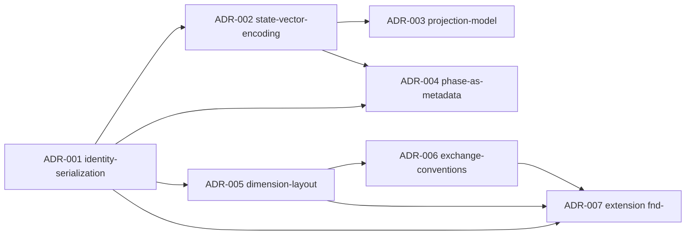

# Implementation ADR Summary

Index of the 7 Implementation ADRs of the EKA v1.0 Reference Implementation. All ADRs have status **accepted** (`content-state: accepted`) and carry `namespace: eka-ref-impl`, dimension `decisions`.

| ADR | Decision (one line) | Status | File |
|---|---|---|---|
| **ADR-001 — Identity Serialization** | Identity encoded completely in frontmatter (`namespace`, `type`, `id`, `instance-version`, `revision`); filename `<type-token>-<id>[-v<nn>]` is a projection, with a 26-token ambiguity-free table — resolving the `mvp-nnn` collision (EKA 6.4, P3, P9). | accepted | [`adr-001-identity-serialization.md`](decisions/adr-001-identity-serialization.md) |
| **ADR-002 — State Vector Encoding** | Status encoded as 5 frontmatter fields per owned state domain (`content-state`, `execution-state`, `planning-state`, `container-state`, `existence-state`); absence = not-applicable; single-writer per field (P6); `change-log` array `{date, domain, from, to, by}`; legacy values mapped to canonical values. | accepted | [`adr-002-state-vector-encoding.md`](decisions/adr-002-state-vector-encoding.md) |
| **ADR-003 — Projection Model** | Container tables and tickets are State Projections (EKA 7.4): tickets carry an empty State Vector with `derives-from: [ctr:<id>]`, header "Generated — State Projection", default on-read refresh (EKA 15.5); projections never write (P6). | accepted | [`adr-003-projection-model.md`](decisions/adr-003-projection-model.md) |
| **ADR-004 — Phase as Metadata** | `phase` becomes a frontmatter field on `scp-`/`plan-` artifacts only (discovery\|mvp\|milestone\|release\|growth\|maturity\|sunset); phase change = context update authorized by the readiness gate (EKA 11.2) and recorded in `change-log` with `domain: phase`; no phase folders. | accepted | [`adr-004-phase-as-metadata.md`](decisions/adr-004-phase-as-metadata.md) |
| **ADR-005 — Dimension Layout** | 12 knowledge folders = 12 Knowledge Dimensions 1:1 + `operating/` (OS) + `exchange/` (EX); location rule: knowledge artifacts live in their dimension folder, validation enforces `dimension == folder`; operating artifacts exempt (EKA 8, P15). | accepted | [`adr-005-dimension-layout.md`](decisions/adr-005-dimension-layout.md) |
| **ADR-006 — Exchange Conventions** | The exchange seam (EKA 13) is realized as `skeleton/docs/exchange/validation.md` (9 Conformance Rules) + `skeleton/docs/exchange/transfer.md` (round-trip, Identity conflict policy = reject or explicit re-namespace, idempotency, schema versioning). | accepted | [`adr-006-exchange-conventions.md`](decisions/adr-006-exchange-conventions.md) |
| **ADR-007 — Extension: Research Finding** | Extension type `fnd-` (Research Finding) registered via the EKA 14.1 extension mechanism: research dimension, owned State Vector `(Content State, Existence State)`, `research/` folder; the spike → durable knowledge Distillation path (EKA 11.4). | accepted | [`adr-007-extension-research-finding.md`](decisions/adr-007-extension-research-finding.md) |

## Shared frontmatter conventions

All ADRs follow the serialization frontmatter contract (see [`adr-001`](decisions/adr-001-identity-serialization.md) and [`reference-architecture.md`](reference-architecture.md)):

```yaml
---
namespace: eka-ref-impl
type: adr
id: <nnn>-<slug>
instance-version: 1
revision: 1
content-state: accepted
existence-state: active
dimension: decisions
author: Engineering Architecture
created: YYYY-MM-DD
updated: YYYY-MM-DD
supersedes: []
derives-from: []
depends-on: []
change-log:
  - date: YYYY-MM-DD
    domain: content-state
    from: proposed
    to: accepted
    by: Engineering Architecture
---
```

## ADR dependency graph


