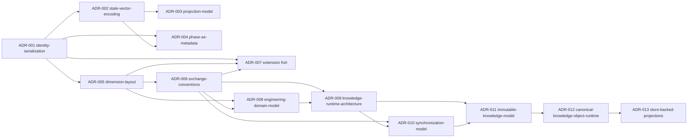

# Implementation ADR Summary

Index of the 13 Implementation ADRs of the EKA v1.1 Reference Implementation (8 serialization ADRs + ADR-009–ADR-013, the v0.2.0 Knowledge Runtime Architecture). All ADRs have status **accepted** (`content-state: accepted`) and carry `namespace: eka-ref-impl`, dimension `decisions`.

| ADR | Decision (one line) | Status | File |
|---|---|---|---|
| **ADR-001 — Identity Serialization** | Identity encoded completely in frontmatter (`namespace`, `type`, `id`, `instance-version`, `revision`); filename `<type-token>-<id>[-v<nn>]` is a projection, with a 26-token ambiguity-free table — resolving the `mvp-nnn` collision (EKA 6.4, P3, P9). | accepted | [`adr-001-identity-serialization.md`](decisions/adr-001-identity-serialization.md) |
| **ADR-002 — State Vector Encoding** | Status encoded as 5 frontmatter fields per owned state domain (`content-state`, `execution-state`, `planning-state`, `container-state`, `existence-state`); absence = not-applicable; single-writer per field (P6); `change-log` array `{date, domain, from, to, by}`; legacy values mapped to canonical values. | accepted | [`adr-002-state-vector-encoding.md`](decisions/adr-002-state-vector-encoding.md) |
| **ADR-003 — Projection Model** | Container tables and tickets are State Projections (EKA 7.4): tickets carry an empty State Vector with `derives-from: [ctr:<id>]`, header "Generated — State Projection", default on-read refresh (EKA 15.5); projections never write (P6). | accepted | [`adr-003-projection-model.md`](decisions/adr-003-projection-model.md) |
| **ADR-004 — Phase as Metadata** | `phase` becomes a frontmatter field on `scp-`/`plan-` artifacts only (discovery\|mvp\|milestone\|release\|growth\|maturity\|sunset); phase change = context update authorized by the readiness gate (EKA 11.2) and recorded in `change-log` with `domain: phase`; no phase folders. | accepted | [`adr-004-phase-as-metadata.md`](decisions/adr-004-phase-as-metadata.md) |
| **ADR-005 — Dimension Layout** | 12 knowledge folders = 12 Knowledge Dimensions 1:1 + `operating/` (OS) + `exchange/` (EX); location rule: knowledge artifacts live in their dimension folder, validation enforces `dimension == folder`; operating artifacts exempt (EKA 8, P15). | accepted | [`adr-005-dimension-layout.md`](decisions/adr-005-dimension-layout.md) |
| **ADR-006 — Exchange Conventions** | The exchange seam (EKA 13) is realized as `skeleton/docs/exchange/validation.md` (Conformance Rules R0–R12) + `skeleton/docs/exchange/transfer.md` (round-trip, Identity conflict policy = reject or explicit re-namespace, idempotency, schema versioning). | accepted | [`adr-006-exchange-conventions.md`](decisions/adr-006-exchange-conventions.md) |
| **ADR-007 — Extension: Research Finding** | Extension type `fnd-` (Research Finding) registered via the EKA 14.1 extension mechanism: research dimension, owned State Vector `(Content State, Existence State)`, `research/` folder; the spike → durable knowledge Distillation path (EKA 11.4). | accepted | [`adr-007-extension-research-finding.md`](decisions/adr-007-extension-research-finding.md) |
| **ADR-008 — Engineering Domain Model** | Five canonical Engineering Domains (Discovery → Architecture → Planning → Execution → Operations, stratum 1 highest → 5) as the primary classification axis above Knowledge Dimensions (Core v1.1 §8.1); Knowledge Stratum = derived authority level with the Stratum Authority Invariant; methodology terms = Representation Aliases; R10 warning / R11 + R12 blocking; Exchange/RSF carry the derived domain, Serialization Version 1.1 with legacy 1 importable. | accepted | [`adr-008-engineering-domain-model.md`](decisions/adr-008-engineering-domain-model.md) |
| **ADR-009 — Knowledge Runtime Architecture** | Canonical Engineering Knowledge moves from the repository into a local EKA Workspace (`~/.eka/`, `EKA_HOME` override; `workspace.json` + `eka.db`) backed by SQLite via `modernc.org/sqlite` (pure Go, no cgo); project-aware canonical store schema v1 (objects/relationships/change_log/attachments/sync_log); the repository becomes a transport medium holding synchronized Knowledge Snapshots; Git stays the VCS. | accepted | [`adr-009-knowledge-runtime-architecture.md`](decisions/adr-009-knowledge-runtime-architecture.md) |
| **ADR-010 — Synchronization Model** | Knowledge Snapshot = deterministic RSF directory package at `exchange/snapshots/`; explicit `eka sync` protocol (pull then push, idempotent, additive, migration from `docs/` via conformance gate + `--from-docs`); one project = many repos partitioned by `source_repo` provenance; Git hooks/wrappers rejected for v0.2, lifecycle extended to Draft → Validate → Publish → Synchronize → Project → Consume. | accepted | [`adr-010-synchronization-model.md`](decisions/adr-010-synchronization-model.md) |
| **ADR-011 — Immutable Engineering Knowledge Model** | Canonical store v2: immutable content-addressed `object_payloads` (object_hash = SHA-256(unit.json ‖ content), byte-identical to the RSF per-unit digest) + mutable `object_refs` resolver (form → current object); `change_log` removed — history derived from forward-only forms, `prev_hash` lineage, and retained payloads; `eka integrity check` verifies independent of the storage engine (0 clean / 1 violations / 2 internal); deterministic v1→v2 migration recomputes hashes; SQLite is persistence only, immutability belongs to the model. | accepted | [`adr-011-immutable-engineering-knowledge-model.md`](decisions/adr-011-immutable-engineering-knowledge-model.md) |
| **ADR-012 — Canonical Knowledge Object Runtime** | Canonical Knowledge Object (CKO) = the `exchange.Unit` model (unit.json + representation payload); the `compile/` Knowledge Compiler is the one gateway for all authoring (Markdown = one adapter via conformance scan/analyze); the runtime consumes only CKO — projections read `exchange.Unit`, SQLite persists CKO (never a Markdown cache), two validators with distinct scopes (`eka validate` R0–R12 vs `eka integrity check`); authoring experience unchanged. | accepted | [`adr-012-canonical-knowledge-object-runtime.md`](decisions/adr-012-canonical-knowledge-object-runtime.md) |
| **ADR-013 — Store-Backed Projections** | Projections are store-backed: `eka view`/`eka watch` read CKO from the workspace canonical store (`store.UnitsByProject` → `exchange.DecodeUnit`), never the docs tree — `compile` stays the authoring gateway for sync docs-mode/migration; projection scope = the project (multi-repo union, digest-tagged, ordered by canonical form); synchronization is a precondition (unregistered repository refused with a deterministic message + hint, exit 1; registered-but-unsynced renders an empty projection with a note, exit 0); one reader, one source (no fallback chain); watch polls the store, the refusal frame replacing the compile-failure frame. | accepted | [`adr-013-store-backed-projections.md`](decisions/adr-013-store-backed-projections.md) |

## Shared frontmatter conventions

All ADRs follow the serialization frontmatter contract (see [`adr-001`](decisions/adr-001-identity-serialization.md) and [`reference-architecture.md`](reference-architecture.md)):

```yaml
---
namespace: eka-ref-impl
type: adr
id: <nnn>-<slug>
instance-version: 1
revision: 1
content-state: accepted
existence-state: active
dimension: decisions
author: Engineering Architecture
created: YYYY-MM-DD
updated: YYYY-MM-DD
supersedes: []
derives-from: []
depends-on: []
change-log:
  - date: YYYY-MM-DD
    domain: content-state
    from: proposed
    to: accepted
    by: Engineering Architecture
---
```

## ADR dependency graph


