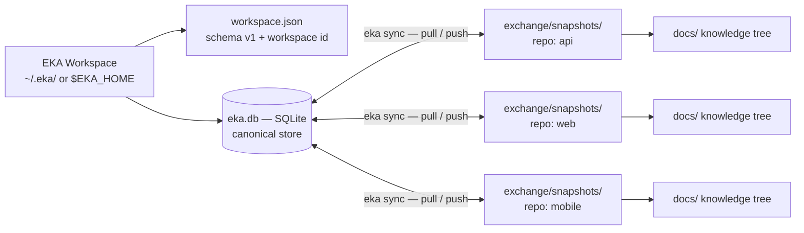

# ADR-009 — Knowledge Runtime Architecture: local EKA Workspace + embedded canonical store

## Context

Since ADR-001, the repository (Git + Markdown) has been the **primary storage** of Engineering Knowledge: Identity, State Vector, Content, Relationships, and Classification all live in `docs/` files, and every read path walks them. That model has served serialization well, but it caps the runtime:

- **Every query is a full scan.** The Knowledge Graph, projections, and `eka view`/`eka watch` rebuild from a `conformance.Scan` of `.md` files on every run; there is no index, no incremental state, no point lookup.
- **No cross-repository union.** Each repository is an island; multi-repository projects (e.g. Atrium: `api`, `web`, `mobile`) have no single place where their complete Engineering Knowledge can be queried as one set.
- **No incremental Knowledge History.** Git history is file history, not knowledge history: forward-only instance versions and a canonical change log exist as conventions (ADR-001, ADR-002, R7), but nothing stores them as queryable data.
- **Future features are blocked.** Knowledge History, Knowledge Timeline, the Context Engine (metadata queries), a machine-readable API, Knowledge Watch, MCP integration, the Knowledge Graph, and Vector Search all need an indexed, queryable runtime — a file tree cannot provide one at reasonable cost.

The v0.2.0 milestone — **Knowledge Runtime Architecture** — resolves this by inverting the storage relationship: canonical Engineering Knowledge lives in a **local EKA Workspace** backed by an embedded database; the repository stops being the primary store and becomes a **transport medium** carrying synchronized Knowledge Snapshots. This is a new storage layer **below** the serialization model, not a redesign of it: Identity, the State Vector, the RSF, Knowledge Dimensions, and Engineering Domains (ADR-008) remain untouched.

## Decision

1. **Local workspace runtime.** Canonical Engineering Knowledge lives in the local **EKA Workspace**: default `~/.eka/` on Linux/macOS, `%USERPROFILE%/.eka/` on Windows, overridable via the `EKA_HOME` environment variable. The workspace holds two persistent files (transient WAL/SHM sidecars appear while the database is open):
   - `workspace.json` — workspace metadata: `schema_version: 1`, a **deterministic workspace id** computed as `"eka-" + first 12 hex chars of SHA-256(absolute workspace path)`, and the created date. The id is derived from the path so it is stable across restarts and reproducible on any machine with the same path.
   - `eka.db` — the SQLite canonical store (below).
   
   Layout invariant: **one workspace, many projects, many repositories.** The workspace is machine-local, never committed, never exchanged.

2. **Embedded database: SQLite via `modernc.org/sqlite` (pure Go, no cgo).** The driver keeps the build portable — the project's CI cross-compiles Windows binaries, and a cgo dependency would break that — while delivering a single-file, ACID, index-capable store. The candidate evaluation is summarized per criterion:

   | Criterion | **SQLite (modernc.org/sqlite) — chosen** | Pebble | BoltDB / bbolt | Badger |
   |---|---|---|---|---|
   | Object lookup | SQL PK indexes: B-tree point lookups on `form`; unique per line | fast key lookup, but key design is manual and per-query | B+tree KV: fast key lookup, no query layer | LSM: fast reads, memory amplification, write amplification tuning |
   | Metadata indexing | declarative SQL indexes on `(namespace,type,id)`, `dimension`, `domain`, `source_repo` | no secondary indexes; every index is hand-maintained key material | no secondary indexes; manual | no secondary indexes; manual |
   | Graph traversal | recursive CTEs over the `relationships` table with forward + reverse lookup indexes | manual BFS in application code, no query planner | manual | manual |
   | Future vector indexing | FTS5 built in; future `sqlite-vec`; JSON columns for vector metadata | none; custom solution required | none | none |
   | Portability | single-file DB; pure-Go driver keeps Windows/ARM cross-compilation (CI cross-compiles Windows binaries) | pure Go, but multi-file SST + WAL/Manifest layout | single file, pure Go, but project effectively unmaintained | pure Go, but heavier on-disk format and tuning |
   | Reliability | decades of production use; ACID; WAL mode; ubiquitous ecosystem | production use (CockroachDB), but younger; requires compaction tuning | proven but minimal maintenance activity | production use (Dgraph), but complex tuning, memory pressure, GC knobs |
   | Simplicity | SQL: one query language, declarative schema, one file | every query is application code | every query is application code | every query is application code + tuning knobs |

   **Accepted costs** (documented, not mitigated in v0.2): binary size growth of roughly **+30 MB** from the embedded driver, and dependency-tree growth from the `modernc.org` family. Determinism is unaffected: the database is a private runtime artifact and never enters serialized output.

3. **Canonical store schema (SQLite, `schema_version: 1`).** One project-aware database for the whole workspace — explicitly **not** database-per-project. `form` is the RSF Canonical Identity Form `<namespace>/<type>:<id>:<instance-version>` (RSF §5.2), giving every table a direct, unambiguous link to the serialization model:

   ```sql
   -- workspace metadata; rows: schema_version, workspace_id
   CREATE TABLE meta (
     key   TEXT PRIMARY KEY,
     value TEXT NOT NULL
   );

   CREATE TABLE projects (
     id      TEXT PRIMARY KEY,
     name    TEXT NOT NULL,
     created TEXT NOT NULL
   );

   CREATE TABLE repos (
     project_id TEXT NOT NULL,
     name       TEXT NOT NULL,
     path       TEXT NOT NULL,
     created    TEXT NOT NULL,
     PRIMARY KEY (project_id, name)
   );
   CREATE UNIQUE INDEX repos_path_uniq ON repos (path);  -- a path is owned by one project

   CREATE TABLE objects (
     form                  TEXT PRIMARY KEY,  -- RSF Canonical Identity Form
     project_id            TEXT NOT NULL,     -- provenance: owning project
     namespace             TEXT NOT NULL,
     type                  TEXT NOT NULL,
     id                    TEXT NOT NULL,
     instance_version      INTEGER NOT NULL,
     revision              INTEGER NOT NULL,
     author                TEXT NOT NULL,    -- "" when absent
     created               TEXT NOT NULL,    -- "" when absent
     updated               TEXT NOT NULL,    -- "" when absent
     content_representation TEXT NOT NULL,   -- e.g. eka/structured-text/1
     content               BLOB,             -- nil only for empty payloads
     state_content         TEXT NOT NULL,    -- "" when the vector lacks the domain
     state_execution       TEXT NOT NULL,
     state_planning        TEXT NOT NULL,
     state_container       TEXT NOT NULL,
     state_existence       TEXT NOT NULL,
     phase                 TEXT NOT NULL,    -- "" when absent
     dimension             TEXT NOT NULL,    -- "" when absent
     dimensions_secondary  TEXT NOT NULL,    -- JSON array; "" when empty
     domain                TEXT NOT NULL,    -- "" when absent
     source_repo           TEXT NOT NULL,    -- provenance: repo name (with project_id)
     digest                TEXT NOT NULL
   );
   CREATE INDEX idx_objects_identity ON objects (namespace, type, id);
   CREATE INDEX idx_objects_dimension ON objects (dimension);
   CREATE INDEX idx_objects_domain    ON objects (domain);
   CREATE INDEX idx_objects_source    ON objects (project_id, source_repo);

   CREATE TABLE relationships (
     form     TEXT NOT NULL,
     rel_type TEXT NOT NULL,
     target   TEXT NOT NULL,
     PRIMARY KEY (form, rel_type, target)
   );
   CREATE INDEX idx_relationships_target ON relationships (target);  -- reverse lookup

   CREATE TABLE change_log (
     form     TEXT NOT NULL,
     seq      INTEGER NOT NULL,
     date     TEXT NOT NULL,
     domain   TEXT NOT NULL,
     from_val TEXT NOT NULL,
     to_val   TEXT NOT NULL,
     by       TEXT NOT NULL,
     PRIMARY KEY (form, seq)
   );

   CREATE TABLE attachments (
     project_id  TEXT NOT NULL,   -- provenance: owning project
     source_repo TEXT NOT NULL,   -- provenance: repo name
     id          TEXT NOT NULL,   -- repo-relative path, forward slashes
     digest      TEXT NOT NULL,
     data        BLOB NOT NULL,
     PRIMARY KEY (project_id, source_repo, id)
   );

   CREATE TABLE sync_log (
     seq            INTEGER PRIMARY KEY AUTOINCREMENT,
     project_id     TEXT NOT NULL,
     repo           TEXT NOT NULL,
     direction      TEXT NOT NULL,
     snapshot_digest TEXT NOT NULL,
     units          INTEGER NOT NULL,
     at             TEXT NOT NULL
    );
    ```

   > **Superseded by ADR-011 (schema_version 2):** the storage model of this section — the `objects`, `relationships`, and `change_log` tables — is **SUPERSEDED** by [ADR-011](adr-011-immutable-engineering-knowledge-model.md): the canonical store now separates immutable, content-addressed `object_payloads` (SHA-256(unit.json ‖ content), byte-identical to the RSF per-unit digest) from the mutable `object_refs` resolver (form → current object); the `change_log` table is removed (change-log data lives in the immutable unit payload). The workspace metadata (`meta`), `projects`, `repos`, `attachments`, and `sync_log` tables and the SQLite selection (trade-off table above) remain in force. ADR-011 is authoritative for the v2 storage model.

   - `objects` is the unit of record: one row per instance line, carrying the full State Vector as scalar columns, Classification (`dimension`, `dimensions_secondary`, `domain`), provenance (`source_repo`), and the content payload plus its digest. Identity and instance versions are immutable and forward-only: a knowledge change produces a new instance version (a new `form`), never a mutation of a prior line.
   - `relationships` stores the five canonical relationship types (ADR-001/ADR-002 conventions) as `(form, rel_type, target)`; the target index makes reverse traversal symmetric and enables recursive CTE walks.
   - `change_log` is the canonical transition record, per form, in sequence order.
   - `sync_log` records every synchronization run (see ADR-010).
   - **Knowledge History** = the `objects` table (immutable identities, forward-only instance versions) **plus** the `change_log` table: the complete, queryable history of every knowledge line, independent of Git history.

4. **Repository model.** Repositories are **synchronization endpoints**, not primary stores. A repository contains:
   - the **`docs/` knowledge tree** — the legacy human-readable representation (Git + Markdown), kept for compatibility and human editing; and
   - the **Knowledge Snapshot** at `exchange/snapshots/` — the canonical transport form (RSF package in directory layout; protocol defined in ADR-010).
   
   **Git remains the VCS — never replaced, never forked.** The workspace database is never committed to any repository.



## Consequences

- **Positive**: indexed point lookup and metadata queries replace full-tree scans; projections, the Knowledge Graph, and future queries read the store instead of re-scanning `.md` files.
- **Positive**: cross-repository union — one project with many repositories yields complete Engineering Knowledge in one workspace database, partitioned by `source_repo` provenance.
- **Positive**: Knowledge History becomes a first-class, queryable structure (`objects` + `change_log`), independent of Git history.
- **Positive**: the schema leaves structural room for the future feature set — graph traversal (recursive CTEs), vector search (content BLOB + future FTS5/`sqlite-vec`), watch (WAL + `sync_log`), machine-readable API (store queries), MCP and Atrium integration — without redesign.
- **Positive**: the repository stays human-readable and Git-native; the docs tree is untouched; determinism of all serialized output is preserved (the database never appears in output).
- **Negative**: binary size growth (~+30 MB) and dependency-tree growth from the `modernc.org` family — accepted, documented.
- **Negative**: dual representation — the `docs/` tree and the snapshot can drift if sync discipline is not followed; the sync protocol (ADR-010) is the reconciliation mechanism.
- **Negative**: the canonical database is machine-local and never committed, so knowledge transport depends on `eka sync` being run; a workspace backup story is now an operational requirement.
- **Negative**: single-writer assumption for the store in v0.2; SQLite WAL mode and `busy_timeout` mitigate concurrent access but do not remove the constraint.

## Alternatives Considered

- **Pebble** — rejected: no SQL, no secondary indexes; every query (lookup, metadata filter, graph walk) would be hand-built application code; no FTS/vector story.
- **BoltDB / bbolt** — rejected: B+tree KV with no query layer or secondary indexes; minimal maintenance activity; the single-writer model would need to be reinvented on top.
- **Badger** — rejected: LSM KV with memory pressure and compaction tuning; no SQL, no indexes; complexity without query payoff.
- **JSON-file store (per-artifact or single blob)** — rejected: no ACID, no indexes, no WAL; queries stay full scans; concurrent writes are unsafe; no history semantics.
- **Database-per-project** — rejected: breaks cross-project queries and the union model, multiplies schema migrations and backup surfaces; one workspace database keeps a single source of truth with project-aware rows.
- **Repository as canonical (status quo)** — rejected: this is precisely the limitation being resolved — full-scan queries, no cross-repo union, no queryable history, no indexed metadata.

## References

- Milestone: EKA v0.2.0 — Knowledge Runtime Architecture (workspace + embedded canonical store + snapshot transport)
- RSF v1.1 — Canonical Identity Form `<namespace>/<type>:<id>:<instance-version>` (§5.2), Content representation model (§6), Attachment model (§7), Integrity (§9.4): [`../eka-reference-serialization-format-v1.1.md`](../eka-reference-serialization-format-v1.1.md)
- CLI contract and exit codes: [`../cli.md`](../cli.md)
- Conformance gate (R0–R12) used by sync migration mode: [`../../skeleton/docs/exchange/validation.md`](../../skeleton/docs/exchange/validation.md)
- Related: [ADR-006](adr-006-exchange-conventions.md) (exchange conventions; snapshot is its RSF realization), [ADR-008](adr-008-engineering-domain-model.md) (Engineering Domain metadata column), [ADR-010](adr-010-synchronization-model.md) (the synchronization protocol over this store)
