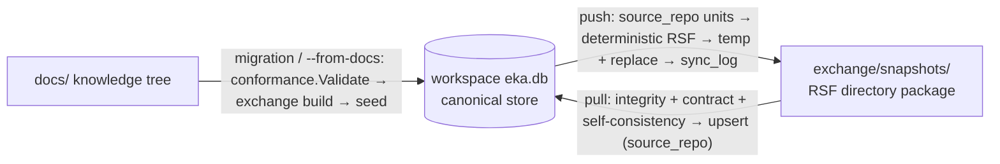

# ADR-010 — Synchronization Model: deterministic snapshot exchange between workspace and repositories

## Context

ADR-009 moves canonical Engineering Knowledge into the local EKA Workspace; the repository becomes a transport medium. That requires a synchronization protocol with three jobs:

1. **Pull** — bring a repository's Knowledge Snapshot into the workspace database (with provenance), idempotently.
2. **Push** — publish workspace knowledge back into the repository as a snapshot, deterministically, so it can be committed with normal Git workflows.
3. **Migrate** — seed the database from existing repositories that have a `docs/` tree but no snapshot yet (the entire installed base of ADR-001…008 repositories).

The existing exchange model (`eka export` / `eka import`, `.ekapkg` packages, ADR-006, RSF v1.1) already defines a lossless, deterministic package contract; the synchronization model reuses it rather than inventing a second format. The v0.2.0 milestone requires the protocol to be **explicit** (user-invoked), **deterministic** (identical state → identical snapshot), **idempotent** (re-sync = no-op), and **Git-native** (the snapshot is ordinary repository content).

## Decision

1. **Knowledge Snapshot = RSF package in directory layout.** A snapshot is an RSF package — `header.json`, `manifest.json`, `declarations.json`, `integrity.json`, `units/`, `attachments/` — written deterministically at `exchange/snapshots/` inside the repository. The directory layout (not the single-file `.ekapkg`) is the canonical transport form for synchronization: it diffs cleanly in Git and is reviewable in pull requests. **Determinism contract:** identical workspace state → byte-identical snapshot. The snapshot is the canonical transport format, evolved from the existing export/import model (ADR-006); terminology is not finalized — a future version may rename the concept.

2. **Synchronization protocol (deterministic).**
   - **pull**: read the snapshot directory → verify integrity + contract + self-consistency via the exchange package (the same verification path as `eka import`) → **upsert** units and attachments into the workspace DB, attributed via the **provenance pair** `(project_id, source_repo)` — the same composite key that keys the repository registry row, so provenance is unique workspace-wide even when two repositories share a basename; idempotent — re-pull of an identical digest is a no-op. **Deletions are NOT applied in v0.2**: the snapshot is an additive transport; this is a documented limitation, with a future deletion protocol reserved.
   - **push**: export DB units and attachments whose provenance pair matches this repository → build a deterministic RSF package → **atomic-ish write** to `exchange/snapshots/` (stage in a temp directory, move the current snapshot aside, rename into place, then drop the old copy) → record the run in `sync_log`.
   - **migration mode**: when a repository has a `docs/` tree but no snapshot yet, pull seeds the DB from the docs tree (conformance validation gate first, then the same package assembly as `eka export`) — the migration path for existing repositories.
   - **explicit re-seed**: `eka sync pull --from-docs` re-seeds from the docs tree (upsert); docs-mode pulls always re-run — the docs tree carries no package digest to skip on.
   - **sync order**: pull, then push; each `eka sync` invocation processes exactly one repository (future milestones may add batch synchronization).
   - **duplicate identity across repos in one project**: deterministic **last-wins overwrite** — when a pull upserts an identity already owned by a different provenance pair with different content, the new value wins and the overwrite is **recorded in the sync report** (source identity and previous owner).

3. **Multi-repository projects.** One project = many repositories (e.g. Atrium: `api`, `web`, `mobile`). Each repository carries only its relevant snapshot; the workspace DB reconstructs the **complete** Engineering Knowledge as the union. Partitioning is by the `(project_id, source_repo)` provenance pair — the identity namespace remains a pure identity concern. **Assumptions:** repositories in one project may share namespaces; partition is by provenance, never by namespace; a repository path is owned by the project that registered it first (re-registration under another project is refused).

4. **Git integration strategy: explicit synchronization.** Users run `eka sync` explicitly; the snapshot is then committed via normal Git workflows (commit, review, push, merge — untouched). Git hooks and wrapper commands were **evaluated and REJECTED for v0.2**: premature automation surprises users and breaks the explicit determinism contract. Future automation via hooks or watch is possible once the protocol matures.

5. **Knowledge lifecycle extension.** The current lifecycle — Produce → Organize → Validate → Project → Exchange → Consume — evolves to include the runtime: **Draft → Validate → Publish → Synchronize → Project → Consume**. Terminology is not finalized; implementation informs the final workflow.

6. **Future features the architecture must naturally support** (not designed now; the schema/protocol leaves room): Knowledge History (`objects` + `change_log` + immutable identities), Knowledge Timeline (`change_log`), Context Engine (metadata indexes), Machine-readable API (store queries), Knowledge Watch (`sync_log` + WAL), MCP integration, Knowledge Graph (`relationships` + recursive CTE), Vector Search (content BLOB + future FTS5/`sqlite-vec`), Atrium unified runtime.

7. **CLI changes (behavioral review).** `eka init`, `eka validate`, `eka export`, `eka import`, `eka view`, `eka watch` remain unchanged — repository-based, backward compatible. New commands:
   - `eka sync [path]` — pull then push (the default workflow);
   - `eka sync pull [path] [--from-docs]` — pull only; `--from-docs` re-seeds from the docs tree;
   - `eka sync push [path]` — push only;
   - `eka project register [path] [--name NAME]` — register a repository under a project;
   - `eka project list` — list registered projects and repositories;
   - `eka status` — report workspace, project, repository, and snapshot state.
   
   Exit codes follow the existing CLI contract: `0` ok, `1` validation/integrity failure, `2` usage/internal. `eka sync` **auto-registers** the current repository (project name = directory basename) when not registered; explicit registration with `--name` exists for multi-repository projects.

8. **Known limitations (v0.2).** Single-writer assumption (documented; SQLite WAL + `busy_timeout` mitigates); deletions not propagated by pull; cross-repo identity conflicts resolve last-wins (recorded in the sync report); no cloud sync; no hooks; snapshot directory swap has a brief non-atomic window (the old snapshot is preserved in `.snapshots-old` until the new one is in place); canonical DB never committed to repositories.

## Consequences

- **Positive**: deterministic and idempotent — identical state produces byte-identical snapshots; re-sync is a no-op; sync reports are deterministic and machine-readable.
- **Positive**: Git remains the VCS and the workflow stays explicit; snapshots are ordinary, diff-friendly repository content reviewable in pull requests.
- **Positive**: migration path for the entire existing installed base (`docs/`-only repositories seed the DB through the conformance gate).
- **Positive**: multi-repository projects get a single union view with provenance partitioning, without touching identity semantics.
- **Positive**: the additive, digest-keyed design leaves structural room for the future feature set (deletion protocol, automation, graph/vector/timeline queries).
- **Negative**: deletions are not propagated in v0.2 — repositories can accumulate units no longer in the workspace; documented limitation, future deletion protocol.
- **Negative**: cross-repo identity conflicts resolve last-wins — silent overwrite risk, mitigated by the sync report record.
- **Negative**: snapshot writes are full-directory replacement — a small non-atomic window; acceptable for v0.2, tightened later.
- **Negative**: dual representation (`docs/` + snapshot) can drift if sync discipline lapses; `--from-docs` and `eka status` are the reconciliation tooling.
- **Negative**: no automation — users must run `eka sync`; hooks/wrappers are deferred until the protocol matures.

## Alternatives Considered

- **Git hooks (post-commit / post-merge auto-sync)** — rejected for v0.2: hooks surprise users, run outside their control, and break the explicit determinism contract; premature automation while the protocol is young. Revisitable once the protocol matures.
- **Wrapper commands (`git eka-*` or shell aliases)** — rejected: forks the Git UX, adds a maintenance surface, and obscures that synchronization is a knowledge-layer operation, not a VCS operation.
- **Auto-sync on validate** — rejected: `eka validate` is a read-only conformance gate (P6, projection philosophy); attaching write side effects to it violates the CLI contract and non-deterministic timing.
- **Cloud-first sync (server-mediated)** — deferred: infrastructure and operational cost; local-first keeps determinism and offline capability; no cloud sync in v0.2 (known limitation).
- **Single-file `.ekapkg` as the snapshot** — rejected for the snapshot role: binary ZIPs diff poorly in Git and hide changes from review; the directory layout is the sync transport, while `.ekapkg` remains available through `eka export`.
- **Deletion propagation in v0.2** — deferred: additive transport is simpler and safe; a tombstone-based deletion protocol is reserved for a future version.

## References

- [ADR-009](adr-009-knowledge-runtime-architecture.md) — the workspace and canonical store this protocol operates on
- RSF v1.1 — package structure (§4), Unit Entry (§5), Manifest (§8), determinism principles (§9), compatibility (§11): [`../eka-reference-serialization-format-v1.1.md`](../eka-reference-serialization-format-v1.1.md)
- Exchange conventions — round-trip and import semantics: [ADR-006](adr-006-exchange-conventions.md), [`../../skeleton/docs/exchange/transfer.md`](../../skeleton/docs/exchange/transfer.md)
- Conformance gate (R0–R12) — the migration-mode validation gate: [`../../skeleton/docs/exchange/validation.md`](../../skeleton/docs/exchange/validation.md)
- CLI contract, exit codes, command model: [`../cli.md`](../cli.md)
- Knowledge lifecycle — current steps this ADR extends: [`../../skeleton/docs/lifecycle.md`](../../skeleton/docs/lifecycle.md)
- Milestone: EKA v0.2.0 — Knowledge Runtime Architecture
