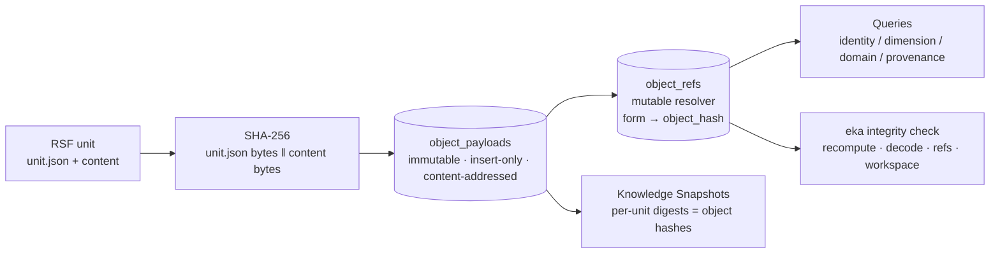

# ADR-011 — Immutable Engineering Knowledge Model

## Context

During implementation of the Runtime Architecture (EKA v0.2.0), one invariant became apparent: **Engineering Knowledge is append-only**. Objects are immutable; every change produces a new immutable object; the runtime must never rely on `UPDATE` for knowledge itself. This is not a storage optimization — it is what makes snapshots verifiable, history derivable, synchronization idempotent, and future replication content-addressed.

ADR-009 selected SQLite as the persistence engine. SQLite must **not** become the source of immutability: the immutable guarantee belongs to the Engineering Knowledge Model, not the storage engine. If immutability were enforced by database triggers or constraints, it would be coupled to SQLite, and a future storage engine would silently lose the guarantee. The model must carry immutability intrinsically — via content addressing — so the persistence layer is replaceable without changing the model.

The v1 canonical store (ADR-009 §3) encoded immutability as application discipline over an `UPDATE`-capable schema: `objects` rows keyed by `form` were *expected* to be forward-only, and the `change_log` table maintained history as a separate mutable structure. The invariant requires stronger, construction-level enforcement.

## Decision

1. **Immutable objects, content-addressed.** The canonical store moves to **schema_version 2** with a two-table separation of immutable payloads from mutable references:

   - **`object_payloads` — IMMUTABLE**: insert-only, never updated, never deleted. The primary key is the content hash, so the object *is* its address and its verification key. No store API exposes an update path; there is no way to express "modify this object".

     ```sql
     -- immutable knowledge payloads: insert-only, never updated, never deleted
     CREATE TABLE object_payloads (
       object_hash TEXT PRIMARY KEY,  -- SHA-256(unit.json bytes || content bytes)
       unit_json   BLOB NOT NULL,     -- canonical RSF unit metadata serialization
       content     BLOB NOT NULL,     -- content payload bytes; zero-length when empty
       prev_hash   TEXT NOT NULL,     -- parent payload hash in the lineage; "" for roots
       created_at  TEXT NOT NULL      -- first-write timestamp (operational, not identity)
     );
     ```

     `object_hash` = `SHA-256(unit.json bytes || content bytes)` — **byte-identical to the RSF per-unit digest** (`exchange/serialize.go`, `deserialize.go`; RSF §9.4). Object hashes therefore agree with snapshot digests by construction and are verifiable independently of any storage engine: the same bytes hashed by the exchange layer, the store, or `eka integrity check` produce the same value. The hash is content-derived, never DB-generated.

     `content` is `NOT NULL` with a zero-length BLOB for empty payloads (never `NULL`): the digest covers `unit.json || content` unconditionally, so the empty case must be represented, not absent.

   - **`object_refs` — MUTABLE reference + derived index columns**: the resolver layer. The `form` — the RSF canonical identity form `<namespace>/<type>:<id>:<instance-version>` — is a **resolver key** pointing at the *current* immutable object via `object_hash`.

     ```sql
     -- mutable resolver: form → current immutable object, plus derived index columns
     CREATE TABLE object_refs (
       form             TEXT PRIMARY KEY,  -- RSF Canonical Identity Form <ns>/<type>:<id>:<v>
       object_hash      TEXT NOT NULL REFERENCES object_payloads(object_hash),
       project_id       TEXT NOT NULL,     -- provenance: owning project
       source_repo      TEXT NOT NULL,     -- provenance: repo name (with project_id)
       namespace        TEXT NOT NULL,
       type             TEXT NOT NULL,
       id               TEXT NOT NULL,
       instance_version INTEGER NOT NULL,
       revision         INTEGER NOT NULL,
       dimension        TEXT NOT NULL,     -- "" when absent
       domain           TEXT NOT NULL,     -- "" when absent
       phase            TEXT NOT NULL,     -- "" when absent
       updated_at       TEXT NOT NULL      -- last reference write (operational)
     );
     CREATE INDEX idx_object_refs_identity ON object_refs (namespace, type, id);
     CREATE INDEX idx_object_refs_dimension ON object_refs (dimension);
     CREATE INDEX idx_object_refs_domain    ON object_refs (domain);
     CREATE INDEX idx_object_refs_source    ON object_refs (project_id, source_repo);
     CREATE INDEX idx_object_refs_hash      ON object_refs (object_hash);
     ```

     Human-friendly identities (REQ-001, ADR-003, …) remain **resolver metadata** — the `id` column of `object_refs` — never the immutable objects themselves. The full State Vector, author/created/updated, `content_representation`, and secondary dimensions are not duplicated into the refs row: they live inside the immutable `unit_json` payload and are read from it. The refs row carries only identity, provenance, the derived classification columns (`dimension`, `domain`, `phase`), and the pointer.

     **No numeric canonical identity anywhere in the knowledge model.** `sync_log`'s `AUTOINCREMENT` is operational bookkeeping (run sequencing), not knowledge identity — knowledge identity is the form (string) and the object hash (content).

2. **Mutable state limited to references and indexes.** The only mutable rows in the knowledge store are `object_refs`. Everything else that mutates is operational, not knowledge: the `projects`/`repos` registry (registration bookkeeping), `sync_log` (run records), and `attachments` (id-keyed payloads with digest verification — attachments are documented here, not redesigned; ADR-009 §3 attachment semantics carry over unchanged). Knowledge itself has exactly one write path — payload insert — and it is append-only.

3. **No dedicated history table.** The v1 `change_log` table is **REMOVED**. Its data already lives inside the immutable `unit.json` payload — the RSF serialization includes the change-log (`change-log` array in the unit metadata) — so a second, mutable copy of history is redundant and would reintroduce the mutable-canonical-state problem. Knowledge history now emerges from three sources, none of which requires maintenance:

   - **(a) Forward-only instance versions = distinct forms.** A knowledge change produces a new instance version — a new form — never a mutation of a prior line (the EKA identity model, P3/P7). Form sequences are history by construction.
   - **(b) Same-form evolution via `prev_hash` lineage.** `prev_hash` embeds the parent payload hash in each immutable payload, forming a chain. Insert is **first-writer-wins**: when a payload with the same `object_hash` already exists, the insert is a no-op — there is only ever one payload per hash, and the lineage is the chain of distinct payloads that were actually written. **Documented gap:** when a superseded payload (already in the store as an unreferenced history payload) is *re-referenced* by a ref update, the ref points at a payload whose `prev_hash` chain does not continue from the immediately previous reference state. This is rare with EKA forward-only transitions (re-referencing an older payload requires an explicit identity regression) and is recorded, not hidden: integrity counts unreferenced payloads, and the refs row always names exactly which payload is current.
   - **(c) Unreferenced payloads retained as the immutable history archive.** Payloads whose hash is no longer referenced are **never deleted** — they are the retained history. Integrity **counts** them (report) but does not **flag** them (not violations).

4. **Integrity as a first-class runtime concern.** New command: **`eka integrity check`** — verifies the store independent of the storage engine, in four levels:

   1. **Payload integrity** — recompute `SHA-256(unit_json || content)` for every payload row and compare with `object_hash`.
   2. **Payload decode** — every `unit_json` payload strict-decodes (unknown fields rejected, the same decode path as the exchange layer).
   3. **Reference integrity** — every `object_refs.object_hash` exists in `object_payloads`; and the refs' derived index columns plus the refs' `form` equal the referenced payload's identity fields (namespace, type, id, instance version, revision parsed back from the payload).
   4. **Workspace integrity** — registry foreign keys (`repos` → `projects`), and attachment digests recomputed against `attachments.data`.

   Manual modification of the SQLite file is **DETECTED, not prevented** — the runtime verifies and reports inconsistencies; it does not pretend a hand-edited database is trusted. Unreferenced payloads are history, not violations (level 3 counts them in the report). Exit codes follow the CLI contract: **`0` clean / `1` violations / `2` internal**. The six violation kinds the check emits map onto the four levels: `payload-hash` (1), `payload-decode` (2), `reference-target` + `reference-index` (3), `attachment-hash` + `registry` (4).

   **Remediation (documented, not automated).** A tampered payload row is flagged permanently — the archive is immutable and there is no repair command in v0.2. The remediation path is manual: remove the tampered row, then re-pull from a clean snapshot or re-seed with `eka sync pull --from-docs`; the reference moves to a verified payload and the check passes again. This is the deliberate consequence of "detected, not prevented": detection is the contract, remediation is operator action.

5. **Migration v1 → v2.** Pre-release migration (v1 existed only inside the v0.2.0 milestone; there is no shipped v1 base): every v1 `objects` row — whose columns carry the full unit (identity, State Vector, classification, provenance, content, digest) — is reconstructed into a unit, serialized canonically (the same serialization the exchange layer uses), **hashed — recomputed, never trusting the v1 digest column** — and stored as a payload plus a ref. `relationships` and `change_log` rows are folded into the reconstructed unit payloads (relationships and the change-log array are part of the RSF unit serialization). `prev_hash` lineage starts **empty** — v1 had no payload history, so no chain exists to preserve; every migrated payload is a root. Deterministic: rows are processed in `form` order, so identical v1 stores migrate to identical v2 stores. The v1 tables (`objects`, `relationships`, `change_log`) are dropped; `meta.schema_version` becomes 2.

6. **Snapshots reference immutable objects.** Knowledge Snapshots (RSF packages, ADR-010) carry per-unit digests that **equal object hashes** — a snapshot already references immutable knowledge, byte for byte. Mutable runtime state (`sync_log`, registry, refs) is **never serialized into packages**: a snapshot contains only payloads and attachments, so two stores with the same knowledge produce identical packages regardless of their refs/timestamps. Future synchronization therefore replicates **immutable knowledge, not mutable database contents** — content-addressed replication deduplicates naturally, and a receiving store verifies each object by hashing it.

7. **Layered responsibilities (unchanged, now explicit).**

   ```
   Engineering Knowledge Model → Immutable Objects → Persistence (SQLite) → Indexes → Resolver → Projection / Context / AI
   ```

   The persistence layer stores and indexes; it never defines Engineering Knowledge semantics. Concretely: the store has **no update path for payloads**, and hashes are **content-derived, never DB-generated**. Every layer above persistence (indexes, resolver, projections) is a derived view over immutable objects — replaceable, rebuildable, and verifiable at any time.

8. **Future compatibility** (not implemented; the model reserves room):
   - **Knowledge Timeline / History** — `prev_hash` chains + form sequences + retained payloads are the complete raw material; a timeline is a read-side projection.
   - **Context Engine** — the refs index columns (`dimension`, `domain`, `phase`) are exactly the metadata query surface; point lookups on existing indexes.
   - **Machine-readable APIs** — read-only views over payloads + refs; immutability makes concurrent readers trivially safe.
   - **Knowledge Graph** — relationships parsed from payloads at read time (no SQL-side graph table in v0.2).
   - **MCP** — a thin adapter over the public store packages.
   - **Synchronization / replication of immutable objects** — content addressing makes cross-device transfer naturally deduplicating and verifiable.
   - **Multi-device** — a device can receive objects, verify them by hash, and rebuild refs locally; no mutable canonical state needs to travel.



## Consequences

- **Positive**: immutability is enforced by construction — there is no update path for payloads, so "modify an object" is not expressible; application discipline is no longer the guarantee.
- **Positive**: integrity is independent of the storage engine — hashes are recomputable from raw bytes; a future engine swap changes nothing about verification.
- **Positive**: history is derived, not maintained — no history table to write, migrate, or keep consistent; forward-only forms + `prev_hash` chains + retained payloads are self-maintaining.
- **Positive**: snapshots and objects share digests — the exchange layer's per-unit digest and the store's object hash are the same value over the same bytes, so transport verification and store verification agree by construction.
- **Positive**: storage engines are swappable — the model carries immutability; SQLite is persistence only (ADR-009's driver trade-offs remain valid for v2).
- **Negative / trade-off**: `prev_hash` lineage is first-writer-wins — re-referencing a superseded payload produces a lineage gap at the ref (the chain does not continue from the previous reference state); rare with EKA forward-only transitions, documented, and the refs row always names the current payload.
- **Negative / trade-off**: retained history grows the database — no GC in v0.2; a future compaction/GC pass could break `prev_hash` chains (history would be lost or truncated) — documented so a future decision is made with eyes open.
- **Negative / trade-off**: derived data (relationships, change-log) requires payload parsing at read time — there are no SQL-side graph or history indexes in v0.2; queries that need them pay a decode cost.
- **Negative / trade-off**: the v1 → v2 migration loses payload-level history — v1 had none (no payload hashes, no chains), so nothing is lost that existed; the migration is lossless with respect to v1's actual data.
- **Negative / trade-off**: store → exchange dependency direction — persistence uses the model's canonical serialization (unit.json bytes) to compute hashes; the dependency is one-way (exchange does not depend on the store) and is documented so it is not accidentally reversed.

## Alternatives Considered

- **SQLite triggers/constraints as the immutability mechanism** — rejected: engine-coupled. The guarantee would live in SQLite DDL and silently vanish (or need re-implementation) on any storage engine swap — exactly the coupling the Context forbids ("SQLite is persistence only").
- **Mutable objects + audit log** — rejected: keeps mutable canonical state; the audit log is a second, derived record that can drift from the objects it describes. This is the v1 shape, and precisely what the clarification forbids: the canonical object itself must be immutable.
- **Hash-as-only-identity without human-friendly resolvers** — rejected: loses EKA identity semantics. The form (`<ns>/<type>:<id>:<v>`) and human-friendly ids (REQ-001) are the knowledge model's identity language; content hashes are the storage/verification layer beneath it. The two-table separation keeps both.
- **Separate per-repo history tables** — rejected: contradicts the project-aware union (ADR-009 §3) — one workspace, many repositories, one knowledge store; per-repo history fragments history across tables and re-introduces the island problem.

## References

- [ADR-009](adr-009-knowledge-runtime-architecture.md) — the runtime ADR; its §3 storage model (`objects`/`relationships`/`change_log`) is superseded by this ADR; the workspace, registry, attachments, `sync_log`, and the SQLite selection remain in force
- [ADR-010](adr-010-synchronization-model.md) — the synchronization protocol this model underpins (snapshots carry digests that equal object hashes)
- [ADR-006](adr-006-exchange-conventions.md) — exchange conventions; origin of the digest/verification contract
- RSF v1.1 — canonical identity form `<namespace>/<type>:<id>:<instance-version>` (§5.2), unit serialization incl. change-log (§5), integrity and per-unit digest (§9.4): [`../eka-reference-serialization-format-v1.1.md`](../eka-reference-serialization-format-v1.1.md)
- Per-unit digest implementation (the definition `object_hash` is byte-identical to): [`../../exchange/serialize.go`](../../exchange/serialize.go), [`../../exchange/deserialize.go`](../../exchange/deserialize.go)
- Runtime document (schema summary + object model sections updated to v2 in parallel): [`../runtime-architecture.md`](../runtime-architecture.md)
- CLI contract and exit codes: [`../cli.md`](../cli.md)
- Conformance gate (R0–R12) used by sync migration mode: [`../../skeleton/docs/exchange/validation.md`](../../skeleton/docs/exchange/validation.md)
</content>
