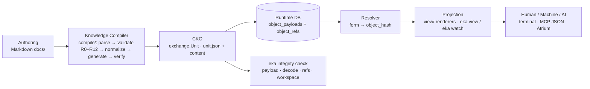

# ADR-012 — Canonical Knowledge Object Runtime

## Context

The v0.2.0 Runtime (ADR-009, ADR-010, ADR-011) successfully separated Engineering Knowledge from the repository: canonical storage moved into the local EKA Workspace, and knowledge became immutable, content-addressed objects. But **Markdown remained the primary internal representation**: the validator (conformance frontmatter parsing, R0–R12), the projections (`eka view`/`eka watch` built over `conformance.Artifact` via `conformance.Scan`), and the docs-mode pull pipeline (`sync/pull.go` → `conformance.Validate` → `exchange.RepositoryPackage`) all depended on Markdown. Every future subsystem — the Context Engine, Machine APIs, MCP, Atrium, the Knowledge Graph, Vector Search — would inherit that coupling. This does not scale: the Runtime must standardize **Engineering Knowledge**, not document formats.

The crucial realization: the milestone-2 immutable model **ALREADY persists canonical objects** — `object_payloads` rows are `unit.json` (JSON) + representation-tagged content, with content-derived hashes equal to RSF digests (ADR-011 §Decision 1); the store has no Markdown awareness; `eka integrity check` is already CKO-based. The pivot therefore **completes the inversion on the consumption side** rather than rebuilding storage: the store was already canonical; the readers were not.

## Decision

1. **Canonical Knowledge Object (CKO) = the `exchange.Unit` model.** The CKO is the one canonical internal representation of one Engineering Knowledge Object, serialized as the RSF unit entry (`unit.json` + the representation payload). The schema is the `Unit` struct (`exchange/model.go`):

   - **Identity** — `Identity{Namespace, Type, ID, InstanceVersion}`; the RSF Canonical Identity Form `<namespace>/<type>:<id>:<instance-version>` (`Identity.CanonicalForm()`).
   - **Revision** — unit metadata, never identity, never an ordering key.
   - **Metadata** — `Author`, `Created`, `Updated` ("" when absent).
   - **State Vector** — `StateVector` carrying the five owned state domains in canonical declared order; empty-vector types serialize as `{}`.
   - **Change Log** — `ChangeLog` entries in occurrence order.
   - **Relationships** — ordered by (type, target).
   - **Classification** — primary `Dimension`, `DimensionsSecondary`, and the Engineering `Domain`.
   - **Phase** — the context attribute on planning/scope artifacts.
   - **Content** — `ContentRef{Representation, File}` (representation identifier + payload), with the raw payload bytes.

   **Derived values, never authored**: the Engineering Domain derives from the type token — `conformance.DomainForToken` is the single source of truth (ADR-008; exposed as `Unit.Domain()`); the Knowledge Stratum derives from the domain — `conformance.Stratum` (ADR-008, stratum 1 highest → 5 lowest). **Integrity metadata**: `object_hash` = `SHA-256(unit.json bytes || content bytes)`, byte-identical to the RSF per-unit digest (ADR-011; RSF §9.4). The CKO schema is **independent of Markdown syntax** — nothing in it references frontmatter, headings, or file layout.

2. **Knowledge Compiler = the canonical gateway.** New `compile/` package: **read authoring representation → parse → validate syntax (authoring conformance R0–R12, the Markdown-aware stage) → normalize → generate CKO → integrity verification (package digest) → hand off** (persist: sync pull; consume: projections). Every future authoring interface — JSON, forms, visual editors, AI-generated knowledge, VS Code extensions, Atrium — enters the Runtime through the same compiler pipeline; Markdown becomes **ONE authoring adapter** — the conformance package's `Scan`/`analyzeFile` (`conformance/scan.go`, `conformance/artifact.go`) *is* that adapter.

3. **Runtime consumes only CKO.** Projections (`eka view` / `eka watch`) are refactored to consume `exchange.Unit` (CKO); the `view` package no longer imports Markdown scanning (`conformance.Artifact`) — **zero Markdown parsing in the Runtime consumption path**. The representation-independent ontology helpers remain shared: `conformance.ParseReference` (reference resolution), `conformance.DomainValues` and `conformance.OwnedDomains` (state-domain taxonomy), `conformance.DomainForToken` and `conformance.Stratum` (domain/stratum derivation). The docs-mode pull (sync) goes through the compiler.

4. **Two validators, two roles.** Authoring validation — `eka validate`, R0–R12 — validates the **authoring representation** and belongs to the authoring adapter / compiler stage 3 (read-only, P6). Runtime validation — `eka integrity check` — validates **CKO integrity** (payload hash, decode, references, attachments, registry) and is already implemented in milestone 2 (ADR-011 §Decision 4). The split is explicit and documented; the runtime never re-validates Markdown.

5. **SQLite persists CKO, never a Markdown cache.** `object_payloads` (`unit.json` + content) + `object_refs` are the CKO store — ADR-011, unchanged, no schema change. The content blob is **opaque and representation-tagged** (`ContentRepresentation = "eka/structured-text/1"` today); a future representation (e.g. JSON authoring) stores its payload under its own representation identifier without schema change. Markdown remains an **authoring artifact, never a runtime artifact**.

6. **Authoring experience unchanged.** Developers keep writing Markdown files in `docs/`; `eka validate` / `eka view` / `eka sync` behave identically. The compiler runs automatically — `view` compiles on demand; `sync` compiles in docs mode. No behavioral change to the authoring workflow.

7. **Presentation representation is a separate concern.** Projection renderers (terminal UI today) are the presentation layer over CKO; future presentations (MCP JSON, Atrium visual components) consume the same CKO contract. The pipeline:

   ```
   Authoring → Knowledge Compiler → CKO → Runtime DB → Resolver → Projection → Human / Machine / AI
   ```



## Consequences

- **Positive**: representation-independent runtime — Markdown is swappable; the runtime never parses it, so replacing the authoring format touches only the adapter, nothing below the compiler.
- **Positive**: one gateway for all future authoring — JSON, forms, visual editors, AI-generated knowledge, VS Code extensions, and Atrium all enter through the same compiler pipeline, inheriting validation, normalization, and integrity verification.
- **Positive**: projections and CKO share the model — `view` reads `exchange.Unit`; the ontology helpers (`ParseReference`, `DomainValues`, `OwnedDomains`, `DomainForToken`, `Stratum`) are the only shared vocabulary.
- **Positive**: future subsystems (Context Engine, Machine APIs, MCP, Atrium, Knowledge Graph, Vector Search) build on the CKO contract — the schema is the model they all consume.
- **Positive**: storage already conformant — milestone 2 persisted CKO all along; this ADR completes the inversion on the consumption side without a storage rebuild.
- **Negative / trade-off**: `view` compiles on demand — authoring validation repeats per invocation; acceptable because it is deterministic and repos are small; store-backed projections remain future work.
- **Negative / trade-off**: content is opaque to the runtime — the presentation layer owns rendering; structured extraction from content is future work.
- **Negative / trade-off**: conformance (the authoring adapter) is inherently Markdown-coupled **by design** — the coupling is contained at the adapter boundary, not eliminated.
- **Negative / trade-off**: authoring validation and runtime validation are distinct commands with distinct scopes — documented, but the split could confuse users who expect one validator.
- **Negative / trade-off**: relationship presentation is re-derived from canonical targets, not the authoring spelling. `view` renders same-namespace targets as line forms with the instance version appended exactly when the target is not the line's lowest instance (lossless for resolution by construction); cross-namespace targets render in full canonical form. Relationship list ordering follows the canonical (type, target) order of the CKO, not the authoring file order — deterministic, resolution-equivalent for conformant repositories.

## Alternatives Considered

- **Keep Markdown as the runtime model and add a per-subsystem abstraction layer** — rejected: the coupling persists; every subsystem (Context Engine, Machine APIs, MCP, Atrium, Knowledge Graph, Vector Search) would still need Markdown knowledge behind its abstraction.
- **Rewrite conformance as a fully generic parser** — rejected: unnecessary. Markdown is the default authoring format, and the adapter boundary already contains the coupling; a generic parser adds generality nothing consumes.
- **Store compiled CKO only at sync time; make projections require a synced workspace** — rejected: breaks the authoring UX — `eka view` must work without a workspace (repository-based, backward compatible, ADR-010 §Decision 7).
- **Introduce a second serialization format distinct from RSF** — rejected: duplicates the canonical model and breaks digest identity with snapshots (per-unit digests equal object hashes by construction, ADR-011 §Decision 6).

## Future Extensibility (not implemented)

The compiler gateway leaves room for all of these; none are built in this milestone:

- **JSON authoring adapter** — conformance-adjacent parse → CKO, under its own representation identifier.
- **Form-based authoring** — a form UI emits through the compiler.
- **AI-generated knowledge** — direct CKO emission through the compiler (no Markdown in the middle).
- **MCP** — CKO over JSON.
- **Atrium** — CKO consumed visually.
- **Knowledge Graph** — CKO relationships (parsed from payloads at read time, ADR-011 §Decision 8).
- **Vector Search** — CKO content embeddings.

## References

- [ADR-009](adr-009-knowledge-runtime-architecture.md) — the runtime ADR: workspace + embedded canonical store; the storage layer this ADR's consumption side reads
- [ADR-010](adr-010-synchronization-model.md) — the synchronization protocol; the docs-mode pull is the compiler's persist hand-off
- [ADR-011](adr-011-immutable-engineering-knowledge-model.md) — the immutable store that persists CKO (`object_payloads`/`object_refs`); `object_hash` = RSF per-unit digest; the CKO store unchanged by this ADR
- [ADR-008](adr-008-engineering-domain-model.md) — Engineering Domain and Knowledge Stratum derivation (`DomainForToken`, `Stratum`)
- RSF v1.1 — unit serialization (§5), content representation model (§6), integrity and per-unit digest (§9.4): [`../eka-reference-serialization-format-v1.1.md`](../eka-reference-serialization-format-v1.1.md)
- CKO model (the schema of the canonical object): [`../../exchange/model.go`](../../exchange/model.go)
- CKO serialization — `MarshalUnit` (canonical `unit.json` bytes): [`../../exchange/emit.go`](../../exchange/emit.go); `DecodeUnit` (strict decode): [`../../exchange/decode.go`](../../exchange/decode.go)
- Markdown authoring adapter — `Scan`/`analyzeFile`: [`../../conformance/scan.go`](../../conformance/scan.go), [`../../conformance/artifact.go`](../../conformance/artifact.go)
- Shared ontology helpers — `DomainForToken`/`Stratum`: [`../../conformance/domain.go`](../../conformance/domain.go); `OwnedDomains`/`DomainValues`: [`../../conformance/state.go`](../../conformance/state.go); `ParseReference`: [`../../conformance/rules.go`](../../conformance/rules.go)
- Runtime validation — `eka integrity check`: [`../../store/integrity.go`](../../store/integrity.go), [`../../cmd/integrity.go`](../../cmd/integrity.go)
- Runtime document (schema summary + object model sections updated in parallel): [`../runtime-architecture.md`](../runtime-architecture.md)
- CLI contract and exit codes: [`../cli.md`](../cli.md)
- Conformance gate (R0–R12), the compiler's authoring-validation stage: [`../../skeleton/docs/exchange/validation.md`](../../skeleton/docs/exchange/validation.md)
