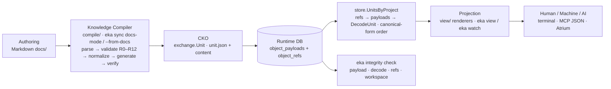

# ADR-013 — Store-Backed Projections

## Context

ADR-012 made the runtime consume only Canonical Knowledge Objects: the `view` package reads `exchange.Unit` and the projections render over CKO — **zero Markdown parsing in the projection renderers**. But the projection *input* was still produced by compiling the authoring docs tree on demand: `eka view` / `eka watch` invoked `compile.Compile(".")` (Markdown → CKO in memory) at every invocation, because the canonical store was not yet wired into the consumption path. ADR-012 recorded this explicitly: *"`view` compiles on demand — authoring validation repeats per invocation; acceptable because it is deterministic and repos are small; **store-backed projections remain future work**"* (ADR-012 §Consequences). That note is what this ADR resolves.

The remaining Markdown dependency was therefore structural, not incidental: the runtime consumption path still required the Markdown files to exist in `docs/`, and it re-ran the authoring conformance gate (R0–R12) on every projection — work that duplicates the sync-time compile and couples the projection to the authoring tree. Meanwhile the store already held everything a projection needs: ADR-011's immutable `object_payloads` (content-addressed CKO) plus the `object_refs` resolver with project provenance — the exact data shape of the project union (ADR-010 §Decision 3). This milestone removes the last Markdown dependency from the runtime consumption path: projections read CKO from the workspace canonical store, completing the pipeline **Authoring → Compiler → CKO → Runtime DB → Resolver → Projection**.

## Decision

1. **Projections are store-backed.** `eka view` / `eka watch` read Canonical Knowledge Objects from the workspace database — `store.UnitsByProject` — instead of compiling the docs tree. The projection source is the **canonical runtime**: Markdown is never read at projection time. `compile` remains the **authoring gateway** (used by sync docs-mode/migration, ADR-010 §Decision 2), but is **no longer imported by the view/watch commands** (`cmd/view.go`, `cmd/watch.go` drop the compile path). The projection input is the decoded current units of the project:

   ```
   object_refs (form, object_hash, project_id, source_repo)  →  object_payloads (unit.json ‖ content)  →  exchange.DecodeUnit  →  view.Graph
   ```

   `store.UnitsByProject(projectID)` is the new store read API: every reference of every registered repository in the project, resolved to its immutable payload (`store.Payload`) and strict-decoded via `exchange.DecodeUnit(unitJSON, content)` (the same reject-by-default unknown-field policy as the exchange layer, RSF §9.5). Only **referenced** payloads are projected — unreferenced payloads are the immutable history archive (ADR-011 §Decision 3(c)), never the current knowledge. The store's content addressing makes the read self-verifying by construction: a projection is built from bytes whose hashes `eka integrity check` recomputes independently.

2. **Projection scope = the project (union).** The projections cover the **complete Engineering Knowledge of the project**: the union of every registered repository's units in that project. Multi-repository projects project as **one knowledge set** — e.g. Atrium `api`/`web`/`mobile` boards merge into a single projection, exactly the union data shape ADR-010 §Decision 3 and ADR-009 §Consequences reserve (partitioned by `source_repo` provenance; a repository path is owned by the project that registered it first, `workspace.FindRepo`). Units are decoded from their immutable payloads (`store.Payload` → `exchange.DecodeUnit`), **digest-tagged** (each unit carries the `object_hash` of the payload it was decoded from), and **ordered by canonical form** (RSF Canonical Identity Form order — the deterministic order of the store's `object_refs`) — the projection input is deterministic: identical synced store state → identical unit sequence → identical projection.

3. **Synchronization becomes a precondition.** A repository must be **registered and synced** before its knowledge can be projected: `eka sync` (explicit, ADR-010) compiles the authoring and seeds the store. The resolution path is: resolve the workspace → resolve the current directory to a registered repository (`workspace.FindRepo`, normalized absolute path) → its project → `store.UnitsByProject`. Failure modes, deterministic:

   - **Unregistered repository — refused, exit `1`.** A repository not registered in the workspace is refused with a deterministic message + hint (stderr): `eka: view refused: repository <abs-path> is not registered in the EKA workspace; run 'eka sync' (auto-registers) or 'eka project register' first`. No projection is produced. This is the exit-1 refusal class of the CLI contract (blocking precondition failure — the slot previously occupied by the compile validation refusal). The resolution is exact-path: the command must run inside the repository root.
   - **Registered project with no synced knowledge — empty projection, exit `0`.** The projection renders empty with an informational note (`no synced knowledge for project <id>; run 'eka sync' after editing docs`), consistent with the existing empty-projection behavior (no active container, no domain artifacts, no tickets already exit 0).

   Authoring UX becomes: **write Markdown → `eka sync` → `eka view`**. Authoring validation (R0–R12) still runs as part of the compile **inside sync** (docs-mode / `--from-docs` conformance gate, ADR-010 §Decision 2); blocking violations refuse the pull with the full report. Projections no longer re-validate authoring per invocation — runtime correctness of the projected units is the store's integrity contract, checked by `eka integrity check`.

4. **One reader, one source.** There is **no fallback chain** (workspace → snapshot → docs): the canonical store is the single projection source. This keeps determinism and the explicit-sync contract; a snapshot- or docs-based projection would re-introduce exactly the coupling and ambiguity this milestone removes (two or three sources with divergent states, silent staleness selection). The snapshot remains a *transport* form (ADR-010), never a projection source.

5. **watch polls the canonical store the same way.** `eka watch` re-reads the units per tick (`store.UnitsByProject` per cycle, `--interval` unchanged), preserving its TTY contract, its byte-comparison redraw logic (identical frames are not redrawn), and its failure-frame design. The failure frame changes shape: the **unregistered-repository refusal frame** replaces the compile-failure frame. Watch keeps polling — when the repository is registered and synced (e.g. `eka sync` run in another terminal), the next tick flips back to the projection automatically, the same recovery shape as the old validation-failure frame. The frame remains a pure function of (store state, projection, target, interval): no clock, no timestamps. Watch exit codes are unchanged (`0` clean stop / `2` usage or internal); the refusal is a rendered state, never an exit — consistent with watch's live-display contract.



## Consequences

- **Positive**: 100% CKO consumption end-to-end — the projection path has **zero Markdown**; the pipeline Authoring → Compiler → CKO → Runtime DB → Resolver → Projection is complete (ADR-012's pipeline now holds at every stage).
- **Positive**: multi-repo union projections — the project scope delivers the cross-repository knowledge set ADR-009/ADR-010 designed for; Atrium `api`/`web`/`mobile` merge into one projection without any per-repo projection logic.
- **Positive**: projections reflect exactly the synced canonical state — digest-tagged units decoded from immutable payloads make every projection integrity-checkable against `eka integrity check`; what is projected is verifiable, byte for byte.
- **Positive**: projections are pure store reads — no per-invocation compile, no repeated authoring validation; `view`/`watch` become the same read-only store-consumer shape as the future subsystems (Context Engine, Machine-readable API, MCP, Atrium).
- **Positive**: watch can later become event-driven on the store (WAL change detection) — noted, not implemented (see Future Extensibility).
- **Negative / trade-off**: projections require a **synced workspace** — a fresh repository must run `eka sync` once before `eka view`; the previously seamless compile-on-demand is replaced by an explicit step. Documented in the CLI help and the runtime document (this is the explicit-sync contract of ADR-010, now applied to projection).
- **Negative / trade-off**: projections reflect the **last sync**, not live authoring edits — an edit is not visible until re-sync; `--from-docs` / `eka sync` are the reconciliation tools. Staleness is the documented, deterministic consequence of a store-backed projection — never a silent hybrid.
- **Negative / trade-off**: a repository outside the workspace **cannot be projected until registered** — `eka view` no longer works on an unregistered clone; registration is one command (`eka sync` auto-registers, ADR-010 §Decision 7).
- **Negative / trade-off**: ADR-012 §Decision 6 ("authoring experience unchanged — `view` compiles on demand") is revised: the compile-on-demand behavior is deliberately replaced by sync-first. This is the resolution of ADR-012's own future-work note, made with eyes open about the UX cost.

## Alternatives Considered

- **Keep compile-on-demand** — rejected: perpetuates the Markdown dependency in the consumption path — the exact thing this milestone removes; every projection re-runs the authoring gate and re-reads `docs/`, and the pipeline stays incomplete at the Resolver→Projection stage.
- **Read the repository snapshot instead of the store** — rejected: a snapshot is per-repository transport (ADR-010), so projection scope would collapse to one repository and lose the project union; it bypasses the canonical store entirely, duplicating the resolver's job and re-introducing a second source of truth.
- **Fallback chain store → snapshot → docs** — rejected: three sources with potentially divergent states introduce ambiguity (which state is projected?) and silent staleness (a stale store silently serving old projections), violating the explicit-sync determinism this milestone is built on.

## Future Extensibility (not implemented)

- **Watch event-driven on the store** — WAL change detection (`sync_log` + WAL) could replace polling; the store-backed read makes this a presentation-loop change only (ADR-010 §Decision 6 reserves the room).
- **Projection scoping flags** — e.g. per-repository projection of a multi-repo project (`--repo` scoping over the union); `UnitsByProject` is the union, per-repo filtering is a trivial read-side refinement over the same API.
- **CKO-driven rendering without the graph rebuild** — resolver caching over `object_refs` index columns; projections already consume CKO, so the renderers need no change when the input becomes cached.

## References

- [ADR-012](adr-012-canonical-knowledge-object-runtime.md) — the CKO ADR; its "store-backed projections remain future work" note is resolved by this ADR; the compiler gateway, CKO model, and two-validator split remain in force
- [ADR-011](adr-011-immutable-engineering-knowledge-model.md) — the immutable store this ADR's projections read (`object_payloads`/`object_refs`; only referenced payloads are projected; unreferenced payloads are history, never projected)
- [ADR-010](adr-010-synchronization-model.md) — the explicit sync protocol that is now the projection precondition; the project union and provenance partitioning define the projection scope
- [ADR-009](adr-009-knowledge-runtime-architecture.md) — the workspace and registry; `workspace.FindRepo` resolves the current directory to its owning project
- Store read path — refs resolver and immutable payloads: [`../../store/refs.go`](../../store/refs.go), [`../../store/payloads.go`](../../store/payloads.go); the new project read API `UnitsByProject` lives alongside them
- Unit decode — `DecodeUnit` (strict, unknown fields rejected, RSF §9.5): [`../../exchange/decode.go`](../../exchange/decode.go)
- Projection commands (compile path removed; store path added): [`../../cmd/view.go`](../../cmd/view.go), [`../../cmd/watch.go`](../../cmd/watch.go)
- Projection engine — `view.NewGraph` over decoded units: [`../../view/graph.go`](../../view/graph.go)
- Workspace registry — repository resolution and path ownership: [`../../workspace/project.go`](../../workspace/project.go)
- Runtime document (CLI table §11 + roadmap §12 updated in parallel; this ADR is authoritative): [`../runtime-architecture.md`](../runtime-architecture.md)
- CLI contract and exit codes: [`../cli.md`](../cli.md)
