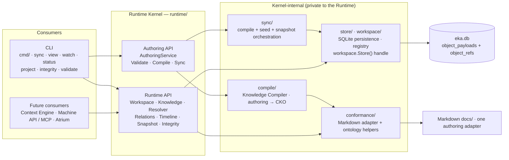

# ADR-014 — Runtime Interface Architecture

## Context

The Runtime now consumes only Canonical Knowledge Objects (ADR-012: projections read `exchange.Unit`, the store persists CKO — never a Markdown cache) and projections read the canonical store (ADR-013: `eka view` / `eka watch` resolve the project via `store.UnitsByProject`). But the **CLI still talks to the storage internals directly**: `workspace.Workspace.DB` is an exported field, so `cmd/view.go` and `cmd/watch.go` call `ws.DB.UnitsByProject(repo.ProjectID)`, `cmd/status.go` calls `ws.DB.SchemaVersion()` and `ws.DB.RecentSyncs(...)`, `cmd/integrity.go` calls `ws.DB.VerifyIntegrity()`; `store.Store.DB()` exposes the raw `*sql.DB` to the workspace registry; `cmd/sync.go` imports `sync`, `compile` and `exchange` directly and switches on `compile.ValidationError` / `exchange.PackageError`; `cmd/validate.go` calls `conformance.Validate` directly. Every future consumer — the Context Engine, the Machine-readable API, MCP, Atrium — would have to learn the same storage internals: SQLite tables, resolver semantics, provenance rules, the integrity contract. Each would re-implement knowledge-shaped logic (what a unit is, what a reference is, what a project's knowledge union is) on top of storage-shaped APIs.

This does not scale. The milestone therefore establishes the **Runtime Kernel**: internal package/service interfaces through which **every** consumer communicates. Direct database access outside the Runtime is **no longer valid architecture** — enforced structurally by the import graph, not by documentation.

## Decision

1. **The Runtime Kernel is the `runtime/` package.** It exposes the **internal Runtime API** — the services Workspace, Knowledge, Resolver, Relations, Timeline, Snapshot, Integrity — and the **Authoring API** — `AuthoringService` with `Validate`, `Compile`, `Sync`. These are package/service method contracts on **concrete types** — deliberately **not** Go interface types: no consumer needs polymorphism yet, and interfaces are introduced when a consumer actually requires them (avoiding premature abstraction). They are **internal architecture contracts**, NOT HTTP/RPC/REST/gRPC — one process, one binary, method calls.

2. **The Runtime API is Engineering-Knowledge-shaped, not CRUD/storage-shaped.** Services return domain types — `exchange.Unit` (= the CKO), `exchange.Package`, reports — and aggregate state (`Workspace.Status`); they never return table rows, `*sql.DB`, or storage keys. The operations:

   | Service | Operations | Returns |
   |---|---|---|
   | Workspace | `Status` | aggregate workspace state (path, schema version, id, created, projects/repos, store totals, last sync per repo) |
   | Knowledge | `Object`, `UnitsByProject`, `Units`, `Search`, `Counts` | `exchange.Unit` (CKO), deterministic unit slices, search results, counts |
   | Resolver | `Resolve`, `ResolveLine` | the unit of one canonical form / the line's units |
   | Relations | `From`, `To`, `Upstream`, `Downstream` | relationship traversal results — **consumers never hand-walk** |
   | Timeline | `Line` | the timeline of one identity line (change-log derived) |
   | Snapshot | `Read` | the repository's snapshot as an `exchange.Package` |
   | Integrity | (backs `eka integrity check`) | the integrity report (ADR-011 §Decision 4 scan) |

   Concretely: resolve/load knowledge via `Knowledge.Object` and `Resolver.Resolve` / `Resolver.ResolveLine`; query/search via `Knowledge.UnitsByProject` / `Knowledge.Units` and `Knowledge.Search` — search filters over the identity tuple and the metadata index columns (namespace, type, id, dimension, domain, phase, provenance); traverse relationships via `Relations.From` / `Relations.To` / `Relations.Upstream` / `Relations.Downstream`; read the timeline via `Timeline.Line`; read the projection source via `Knowledge.UnitsByProject`; read the snapshot via `Snapshot.Read`; read the workspace via `Workspace.Status` and `Knowledge.Counts`. **The Runtime API never understands Markdown**: no file paths, no frontmatter, no docs tree — those live only behind the authoring adapter.

3. **The Authoring API produces only CKO.**

   - `AuthoringService.Validate` — the authoring conformance gate (R0–R12) against the authoring representation.
   - `AuthoringService.Compile` — authoring → CKO **via the Knowledge Compiler** (`compile/`).
   - `AuthoringService.Sync` — **compile + seed the canonical store + snapshot write** — the explicit synchronization of ADR-010 (pull then push, idempotent, auto-registration, `sync_log` recording).

   The service is **stateless** and never exposes database implementation details. Markdown is **one authoring adapter** behind it; future adapters — visual editors, AI-generated knowledge, forms, VS Code extensions, Atrium — enter through the same API, inheriting validation, compilation and integrity verification.

4. **Storage isolation.** SQLite (`store/`) becomes a **private persistence implementation**. The `store/`, `workspace/`, `sync/` and `compile/` packages remain internal to the Kernel; `cmd/` (production) **must not import them** — the CLI becomes a client of the runtime services only. The persistence handle — `workspace.Store()` (the accessor replacing the currently exported `Workspace.DB` field) — is **internal to the Kernel**: no package outside `runtime/` touches it, and the raw `*sql.DB` exposure (`store.Store.DB()`) is withdrawn from non-Kernel use. **Tests may use `store`/`workspace` directly** for seeding and corruption fixtures — testing the integrity detector requires corrupting the store — test-only, documented. Future storage engines are replaceable without changing any consumer.

5. **The CLI is a runtime client.** Every runtime-touching command delegates to the runtime services: `eka sync` → `AuthoringService.Sync`; `eka view` / `eka watch` → `Knowledge.UnitsByProject` + the projection renderer; `eka status` → `Workspace.Status`; `eka project register` / `eka project list` → the Workspace service's registry surface; `eka integrity check` → the Integrity service; `eka validate` → `AuthoringService.Validate`. **Output and exit codes are unchanged — all pinned CLI tests pass** (`0` ok / `1` blocking violation or integrity failure / `2` usage or internal error; the ADR-013 refusal messages and empty-projection notes render byte-identically). `eka init` stays the authoring adapter (bootstrap/ repo generation); `eka export` / `eka import` stay exchange transport operations — they touch repository files and packages, **never the runtime store**.

6. **Package organization** — one-way dependencies, no cycles:

   ```
   Domain Model     exchange/      CKO + RSF
   Adapters         conformance/   Markdown adapter + ontology helpers (authoring)
                    bootstrap/     repository generation
   Compiler         compile/       Knowledge Compiler
   Persistence      store/         SQLite canonical store (private to the Kernel)
   Runtime Services runtime/       the Kernel (+ sync/ orchestration beneath the Authoring API)
   Renderer         view/ + cmd/ui projection rendering
   CLI (consumer)   cmd/           client of the runtime services
   ```

   Dependency rule: `runtime` → {`store`, `workspace`, `sync`, `compile`, `conformance` (helpers), `exchange`}; `cmd` → {`runtime`, `exchange`, `view`, `conformance` (model types + the representation-independent reference-parsing helper `ParseReference`), `bootstrap`, `ui`}. Nothing outside `runtime/` imports `store/`, `workspace/`, `sync/` or `compile/` in production code.



## Consequences

- **Positive**: one sanctioned way in — the Kernel is the single entry point; consumers learn the knowledge-shaped contract once, never storage internals.
- **Positive**: SQLite is swappable — persistence sits behind the Kernel; a future storage engine changes nothing for consumers (ADR-011's "SQLite is persistence only" now has the structural boundary it was missing).
- **Positive**: future components (Context Engine, Machine-readable API, MCP, Atrium, alternative authoring) build on the same contracts — the CKO-shaped API is the shared vocabulary, exactly the future set ADR-012/ADR-013 reserved.
- **Positive**: the CLI slims to a client — `cmd/` drops its storage knowledge; commands reduce to delegation, rendering and exit-code mapping, and the pinned CLI tests keep the output contract honest.
- **Positive**: enforcement is structural — the isolation is checkable mechanically (the import graph: `go list` / an import linter); a violation is a visible architectural error, not a convention breach.
- **Negative / trade-off**: the services wrap the internal packages — some are thin (`AuthoringService.Validate` ≈ the conformance gate, `Knowledge.Counts` ≈ store counts); mitigated because the services add real value (aggregation, traversal, search filtering, domain-shaped returns) and the wrapping concentrates knowledge-shaped semantics in exactly one place — the place every future consumer shares.
- **Negative / trade-off**: reverse traversal (`Relations.To` / `Relations.Downstream`) and metadata search are **scan-based in v0.2** — in-memory filters over the project's units — deterministic and fine at runtime scale, with indexed SQL reserved as a later optimization.
- **Negative / trade-off**: alias re-exports — `SyncResult = sync.Report` and its siblings (the authoring validation report, the integrity report) — leak the internal package names into the API surface; accepted as **contract types** (the reports are the domain-shaped return values).
- **Negative / trade-off**: in-memory search does not use the SQL indexes yet — the `object_refs` index columns (`dimension`, `domain`, `phase`, identity tuple) exist but search filters in memory in v0.2; a future optimization pushes the filter into SQL.

## Alternatives Considered

- **Go interface types per service now** — rejected: premature. No consumer needs polymorphism today; interfaces would add indirection without a consumer, and the decision records that they are introduced when a consumer requires them.
- **HTTP/RPC/gRPC** — rejected: explicitly out of scope. These are internal contracts between packages in one process; a wire protocol adds serialization, lifecycle and failure modes nothing consumes.
- **Expose `store`/`workspace` to consumers with documentation-only discipline** — rejected: unenforceable. The milestone's success criterion is **structural isolation** (imports), not convention; the current `ws.DB` usage shows how fast documented discipline erodes.
- **One giant Runtime struct with all methods** — rejected: unreadable and boundary-less; it defeats the knowledge-shaped organization (services map to concerns: knowledge, resolution, relationships, timeline, snapshot, integrity, authoring).

## Future Extensibility (not implemented)

- **Context Engine** — `Knowledge.Search` + `Relations` traversal are its query surface; it builds on the Kernel without learning storage.
- **Machine-readable API / MCP** — CKO serialization over the same services; a thin adapter, exactly as ADR-011 §Decision 8 reserved.
- **Atrium** — the projection source (`Knowledge.UnitsByProject`) + the resolver (`Resolver.Resolve`/`ResolveLine`) are the read path it needs.
- **Semantic / vector search** — a separate capability behind the `Knowledge.Search` boundaries, not a new storage contract.
- **Storage engine replacement** — `store/` behind the Kernel; the swap is a Kernel-internal change.

## References

- [ADR-013](adr-013-store-backed-projections.md) — the ADR this one derives from: store-backed projections (`store.UnitsByProject`) are the read path the Runtime API now wraps; its refusal messages and empty-projection notes are pinned CLI behavior this ADR preserves
- [ADR-012](adr-012-canonical-knowledge-object-runtime.md) — the CKO runtime: `exchange.Unit` is the domain type the Runtime API returns; the compiler gateway is the Authoring API's engine
- [ADR-011](adr-011-immutable-engineering-knowledge-model.md) — the immutable store behind the Kernel; the integrity scan (`VerifyIntegrity`) is the Integrity service's contract
- [ADR-010](adr-010-synchronization-model.md) — the explicit synchronization `AuthoringService.Sync` realizes (pull then push, idempotent, auto-registration)
- [ADR-009](adr-009-knowledge-runtime-architecture.md) — the workspace and registry the Workspace service aggregates
- Persistence handle — the exported `Workspace.DB` field replaced by the Kernel-internal `workspace.Store()` accessor: [`../../workspace/workspace.go`](../../workspace/workspace.go); the raw `*sql.DB` exposure withdrawn from non-Kernel use: [`../../store/store.go`](../../store/store.go)
- Store read path wrapped by the Knowledge service — `UnitsByProject`/`Units`: [`../../store/units.go`](../../store/units.go); refs and index columns: [`../../store/refs.go`](../../store/refs.go); integrity scan: [`../../store/integrity.go`](../../store/integrity.go); sync log: [`../../store/sync_log.go`](../../store/sync_log.go)
- Sync orchestration beneath the Authoring API — `sync.Run` and `sync.Report` (alias re-exported as the contract type `SyncResult`): [`../../sync/sync.go`](../../sync/sync.go)
- Knowledge Compiler — `compile.Compile` and `compile.ValidationError`: [`../../compile/compile.go`](../../compile/compile.go)
- Authoring adapter + gate — `conformance.Validate` (R0–R12): [`../../conformance/validate.go`](../../conformance/validate.go); adapter scan: [`../../conformance/scan.go`](../../conformance/scan.go)
- Domain model — the CKO (`exchange.Unit`): [`../../exchange/model.go`](../../exchange/model.go); strict decode: [`../../exchange/decode.go`](../../exchange/decode.go)
- CLI consumers rewired to runtime services: [`../../cmd/view.go`](../../cmd/view.go), [`../../cmd/watch.go`](../../cmd/watch.go), [`../../cmd/sync.go`](../../cmd/sync.go), [`../../cmd/status.go`](../../cmd/status.go), [`../../cmd/integrity.go`](../../cmd/integrity.go), [`../../cmd/project.go`](../../cmd/project.go), [`../../cmd/validate.go`](../../cmd/validate.go)
- Projection renderer over the runtime read path — `view.NewGraph` / `view.Build`: [`../../view/graph.go`](../../view/graph.go)
- Authoring bootstrap adapter (`eka init`): [`../../bootstrap/`](../../bootstrap/)
- The Runtime Kernel — the `runtime/` package (implemented in parallel with this ADR; this document is the authoritative contract for its services)
- Runtime document (Kernel section updated in parallel; this ADR is authoritative): [`../runtime-architecture.md`](../runtime-architecture.md)
- CLI contract and exit codes: [`../cli.md`](../cli.md)
