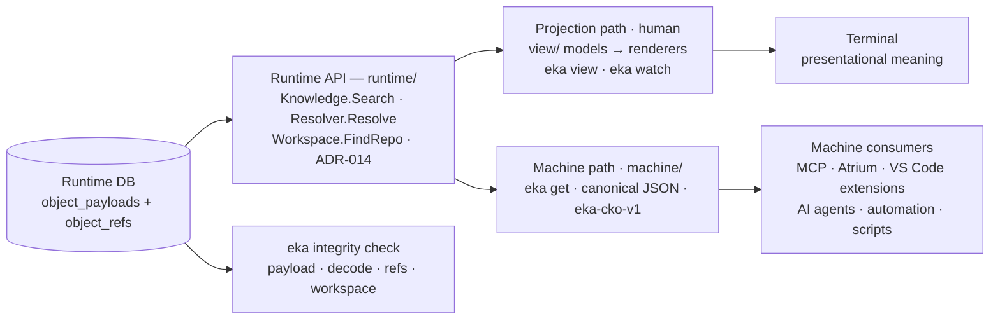

# ADR-015 — Machine Retrieval Interface

## Context

The Runtime Kernel (ADR-014) established the one sanctioned entry point: the internal Runtime API (Workspace, Knowledge, Resolver, Relations, Timeline, Snapshot, Integrity) plus the Authoring API, consumed today by the CLI. Human interaction happens through projections: `eka view` / `eka watch` render the store-backed project union into terminal boards, dependency trees and status lists (ADR-013). But the consumers that want the **knowledge itself** are still unserved. MCP, Atrium, VS Code extensions, AI agents, automation and plain scripts need Canonical Knowledge Objects directly — machine-readable, deterministic, stable — without parsing projections, without parsing Markdown, and without touching storage. ADR-014 §Future Extensibility reserved exactly this slot: *"Machine-readable API / MCP — CKO serialization over the same services; a thin adapter, exactly as ADR-011 §Decision 8 reserved."*

Projections cannot fill the role. A projection is presentational by construction: it derives projected status, boards and dependency trees — meaning for human eyes, not the underlying facts. A machine consumer that reads projections would have to invert the presentation to recover the knowledge; a machine consumer that parses Markdown or queries SQLite directly would violate the Kernel isolation (ADR-014 §Decision 4) and the CKO-only runtime (ADR-012 §Decision 3). This milestone therefore introduces **`eka get`** — the reference implementation of the machine interface: the first consumer beyond the human CLI commands, and the proof that the Runtime API is sufficient for a machine-shaped consumer.

## Decision

1. **`eka get` is the canonical machine interface.** It retrieves Engineering Knowledge as canonical JSON generated **directly from Canonical Knowledge Objects** (`exchange.Unit`) via the Runtime API — `Knowledge.Search`, `Resolver.Resolve`, `Workspace.FindRepo`. It **never** renders for readability, **never** parses Markdown, **never** queries SQLite, **never** reuses projection renderers. Human visualization and machine retrieval are deliberately separated:

   ```
   Human:   store → Runtime API → projection model (view/)  → renderer → terminal
   Machine: store → Runtime API → CKO (machine/)            → canonical JSON → stdout
   ```

   Projections derive **presentational meaning** (projected status, boards, dependency trees); `eka get` preserves **complete Engineering Knowledge semantics** — identity, state, relationships, change-log, content, integrity metadata — with **no presentational transformation**. The two paths share only the Runtime API and the CKO model; they can never drift because both are pure functions of the same objects (see Decision 5).

2. **Canonical JSON contract (schema `eka-cko-v1`).** One CKO = one **Document**. The Document serializes the unit's fields in the fixed declared order of the table (the serialization order — machine consumers may rely on it):

   | Field | Source (CKO) | Notes |
   |---|---|---|
   | `schema` | contract constant | `"eka-cko-v1"` — the stable schema string every Document carries |
   | `identity` | `Unit.Identity` | the complete identity tuple: `namespace`, `type`, `id`, `instance_version` (RSF unit.json naming) |
   | `canonical_form` | `Identity.CanonicalForm()` | `<ns>/<type>:<id>:<v>` — the RSF Canonical Identity Form |
   | `engineering_domain` | derived | the Engineering Domain: `Classification.Domain` when present, else `conformance.DomainForToken` on the type token (ADR-008) |
   | `stratum` | derived | `conformance.Stratum(engineering_domain)` — the Knowledge Stratum, 1 highest → 5 lowest (ADR-008) |
   | `revision` | `Unit.Revision` | unit metadata — never identity, never an ordering key |
   | `author` / `created` / `updated` | `Unit.Author` / `Created` / `Updated` | omitted when empty (`""` on the source) |
   | `state_vector` | `Unit.StateVector` | the five owned domains in canonical declared order — `content-state`, `execution-state`, `planning-state`, `container-state`, `existence-state`, **same field naming as the RSF unit.json**. The block is **always present** (RSF §5.1.1 empty-vector convention): a unit that owns no state domains renders `{}`, never an absent key |
   | `phase` | `Unit.Phase` | the phase context attribute (planning/scope artifacts); omitted when absent |
   | `classification` | `Unit.Classification` | `dimension`, `dimensions_secondary`, `domain` |
   | `relationships` | `Unit.Relationships` | the stored order — the CKO's canonical (type, target) order; each entry `{type, target}` |
   | `change_log` | `Unit.ChangeLog` | occurrence order; each entry `{date, domain, from, to, by}` |
   | `content` | `ContentRef` + payload | `{representation, text}` — `representation` is the Representation Identifier (`eka/structured-text/1` today), `text` is the **opaque representation payload carried verbatim** |
   | `object_hash` | payload digest | the content-derived digest of the immutable payload the unit was decoded from: `SHA-256(unit.json ‖ content)`, byte-identical to the RSF per-unit digest (ADR-011) — the digest-tag of ADR-013 |

   **Content is never parsed or re-structured.** Markdown is one representation (`eka/structured-text/1`); the JSON carries it verbatim as CKO content — it does **not** serialize Markdown structure (headings, frontmatter, files). The RSF's `file` indirection is package-layout-specific and has no place in the machine document; the payload travels inline as `text`.

   **Determinism.** Fixed struct field order (the table above is the order), stable schema string, collections sorted by canonical form (`relationships` by the CKO's stored (type, target) order, `change_log` in occurrence order), **no timestamps, no host-dependent values**. Identical synced store state → byte-identical JSON.

   **Schema stability.** `eka-cko-v1` is stable across minor releases — future tooling can depend on it. Changes are **additive** (new fields appended) or **schema-versioned** (a breaking change bumps the schema string; it never mutates the contract under existing consumers).

3. **Query model — knowledge-shaped, minimal.** `eka get` takes exactly one target, no flags in v0.2. Two target shapes, discriminated syntactically:

   - **(a) Identity lookup — a target containing `:`** resolves via the **Resolver** (`Resolver.Resolve`): the RSF **canonical form** (`<ns>/<type>:<id>:<v>`, the exact instance) or the **qualified line form** (`<ns>/<type>:<id>`, the lowest instance-version of the line). The **namespace is required** — unqualified forms (`<type>:<id>`) are refused as ambiguous, matching the Resolver contract (the Runtime resolves globally, with no referrer context; `runtime/resolver.go`). Result: one **Document** (`eka-cko-v1`). Tickets and containers are identity lookups on their type tokens — `eka get acme/tkt:EK-123`, `eka get acme/ctr:core` — no storage concepts exposed anywhere in the query surface.
   - **(b) Domain query — a target without `:`** names one of the **five Engineering Domains** (`discovery` / `architecture` / `planning` / `execution` / `operations`) and returns the project's units of that domain as a **Collection**:

     ```json
     {
       "schema": "eka-cko-v1",
       "collection": "domain",
       "domain": "Planning",
       "count": 4,
       "units": [ /* Documents, sorted by canonical form */ ]
     }
     ```

     `collection` is the discriminator: a Collection carries it, a single-object Document does not. The units are the project's units whose `Classification.Domain` equals the token, selected via `Knowledge.Search` (`SearchQuery{ProjectID, Domain}`) over the project union, **sorted by canonical form** — the `domain` field of the Collection carries the canonical domain name (e.g. `"Planning"`), not the query token. The classification is set at compile time, so the Document-derivation token fallback (Decision 2) applies only to hand-built units, never at query time.

   Failure handling, deterministic: an unparseable identity or an unknown domain token (a `:`-less target that is not one of the five) is a **usage error** (exit `2`); an identity that resolves to nothing is reported as unknown (exit `2`). The Resolver's rejection of unqualified forms is likewise a usage error — the refusal message names the required forms.

4. **Runtime independence.** The command is a **Runtime client** — the same consumer shape as `eka view`, nothing more:

   | Channel | Contract |
   |---|---|
   | `stdout` | **only** the JSON document (+ one trailing newline). No banners, no progress, no decorations — the output is machine-parseable as-is. |
   | `stderr` | errors and refusals — deterministic messages with hints |
   | exit `0` | success — the Document or Collection was emitted |
   | exit `1` | **workspace or repository-state refusal** — mirrors `eka view`'s unregistered-repository refusal class (ADR-013 §Decision 3): a missing workspace (detached `runtime.Open` — `eka get` **never creates a workspace**, the detached state is a refusal, not an initialization) and an unregistered repository (`Workspace.FindRepo` misses) both refuse with a deterministic message + hint |
   | exit `2` | usage (unparseable target, unknown domain token, unqualified identity), **unknown identity**, internal error |

   `eka get` is read-only end to end: `runtime.Open` (the read-style entry, never `runtime.Ensure`), resolve, query, serialize, emit. It never registers, never syncs, never writes the store.

5. **Separation from projections, formally.** `view` consumes **projection models** (`view/`); `get` consumes **CKOs** (`machine/`). The two share only the Runtime API and the CKO model — no projection code is reachable from the machine path and no machine code from the projection path:

   ```
   cmd/view.go, cmd/watch.go → view/ → runtime API          (projection path)
   cmd/get.go                → machine/ → runtime API       (machine path)
   ```

   The machine path imports `{runtime, exchange, conformance}` (conformance for the representation-independent ontology helpers behind the derived fields); it never imports `view/`. The projection path never imports `machine/`. This is why the Runtime Interface ADR (**ADR-014**) is deliberately NOT amended: the separation is a **new capability with its own contract**, recorded here — ADR-014's dependency rule gains one consumer command, nothing in the Kernel changes.

6. **Future extensibility (not implemented).** Relationship traversal, knowledge graph, timeline/history, semantic/vector search, metadata filtering, context generation — all naturally grow as `eka get` targets/flags over the **same Runtime API** (Resolver, Relations, Timeline, `Knowledge.Search` boundaries, ADR-014). The JSON stays `eka-cko-v1`-compatible: everything is additive.



## Consequences

- **Positive**: machine consumers get stable, deterministic CKO JSON with zero storage knowledge — no SQLite, no Markdown, no projection parsing; the Runtime API is the only surface they learn.
- **Positive**: human and machine paths cannot drift — one CKO source of truth; `eka view` and `eka get` are two pure projections of the same objects.
- **Positive**: the JSON is independent of projection rendering — a rendering change in `view/` can never touch the machine contract.
- **Positive**: the reference implementation proves the Runtime API sufficiency — `eka get` is the first machine-shaped consumer of the Kernel; it validates the knowledge-shaped contract against a second consumer class before MCP/Atrium build on it.
- **Negative / trade-off**: `content.text` carries the raw representation payload — large for big artifacts; a machine consumer needing only metadata pays the size. Documented remedy: a future content-filter flag.
- **Negative / trade-off**: unqualified identity forms are refused — the namespace must be spelled out on every identity lookup; ambiguity is avoided (matching the Resolver's global-resolution contract) at the cost of verbosity.
- **Negative / trade-off**: domain queries return all units of the domain — no pagination in v0.2; the Collection envelope (`count` + `units`) leaves the room for it.
- **Negative / trade-off**: the JSON duplicates (by design) the RSF unit.json field naming for state/relationships — consistency with the ratified serialization outweighs inventing new names; machine consumers already familiar with RSF read the Document without a second vocabulary.

## Alternatives Considered

- **Emit `unit.json` verbatim** — rejected: it leaks package-layout specifics (`content.file`) and lacks the derived domain, stratum and object hash — the envelope adds exactly the knowledge semantics machine consumers need (identity + canonical form, derived classification, integrity metadata).
- **Render projections to JSON** — rejected: projections are presentational models (projected status, boards, dependency trees), not CKO — reconstructing knowledge from them violates the "no reconstruction from projections" principle this ADR is built on.
- **HTTP/REST/gRPC** — rejected: explicitly out of scope. The contract is internal-first (one process, one binary — ADR-014's position); wire protocols are a separate future decision, and `eka get` is the reference implementation that a future wire adapter can wrap.
- **Extend `eka view` with a JSON flag** — rejected: mixes the human and machine paths in one command; this milestone's requirement is **full separation** (Decision 5) — a JSON mode on `view` would couple the machine contract to projection command evolution.

## Future Extensibility (not implemented)

All of the following grow as `eka get` targets/flags over the same Runtime API; none are built in this milestone, and none change the JSON contract (additive only):

- **Relationship traversal** — outgoing/incoming edges per identity over `Relations.From` / `Relations.To` (and resolved units via `Upstream` / `Downstream`).
- **Knowledge graph** — a graph-shaped response over the same relationships (ADR-011 §Decision 8's read-time parsing stays where it is; the machine interface is a consumer, not a parser).
- **Timeline / history** — per-line instance lists via `Resolver.ResolveLine` and `Timeline.Line`.
- **Semantic / vector search** — a separate capability behind the `Knowledge.Search` boundaries (ADR-014 §Future Extensibility), surfaced as a future query target.
- **Metadata filtering** — search-shaped filters (dimension, phase, namespace, type) over the existing `SearchQuery` columns.
- **Context generation** — composed Documents for AI-agent context windows, assembled from the same Runtime API surfaces.
- **Content filtering** — an opt-out flag dropping `content.text` for metadata-only consumers (the documented remedy for the payload-size trade-off).

## References

- [ADR-014](adr-014-runtime-interface-architecture.md) — the ADR this one derives from: the Runtime Kernel; the Runtime API services `eka get` consumes; **deliberately NOT amended** — the machine interface is a new capability with its own contract (Decision 5)
- [ADR-013](adr-013-store-backed-projections.md) — store-backed projections; the unregistered-repository refusal whose exit-`1` semantics `eka get` mirrors; the digest-tagged units the Document serializes
- [ADR-012](adr-012-canonical-knowledge-object-runtime.md) — the CKO (`exchange.Unit`) the machine Document serializes; the CKO-only runtime the machine path inherits
- [ADR-011](adr-011-immutable-engineering-knowledge-model.md) — the immutable store behind the Kernel; `object_hash` = `SHA-256(unit.json ‖ content)`, the content-derived digest the Document carries
- [ADR-010](adr-010-synchronization-model.md) — the explicit sync that is the machine interface's precondition (registered + synced repository)
- [ADR-008](adr-008-engineering-domain-model.md) — Engineering Domain and Knowledge Stratum derivation (`DomainForToken`, `Stratum`), the derived fields of the Document and the domain query's vocabulary
- CKO model — the schema of the canonical object: [`../../exchange/model.go`](../../exchange/model.go)
- CKO serialization — `MarshalUnit` (the RSF unit.json whose field naming the Document duplicates by design for state/relationships): [`../../exchange/emit.go`](../../exchange/emit.go)
- Derived values — `DomainForToken` / `Stratum`: [`../../conformance/domain.go`](../../conformance/domain.go)
- Runtime entry points — `Open` / detached semantics (`Exists() == false`, refusal exit `1` for `eka get`): [`../../runtime/runtime.go`](../../runtime/runtime.go)
- Knowledge service — `Search` / `SearchQuery` (the domain query's filter surface): [`../../runtime/knowledge.go`](../../runtime/knowledge.go)
- Resolver service — `Resolve` / `ResolveLine` (identity lookup; the unqualified-form refusal): [`../../runtime/resolver.go`](../../runtime/resolver.go)
- Workspace service — `FindRepo` (the repository-state refusal): [`../../runtime/workspace.go`](../../runtime/workspace.go)
- The machine package — `machine/` (implemented in parallel with this ADR; this document is the authoritative contract for its JSON and query semantics)
- The reference implementation — `cmd/get.go` (implemented in parallel with this ADR; this document is authoritative)
- Runtime interface document (machine section updated in parallel): [`../runtime-api.md`](../runtime-api.md)
- CLI contract and exit codes: [`../cli.md`](../cli.md)
- ADR index: [`../adr-summary.md`](../adr-summary.md)
