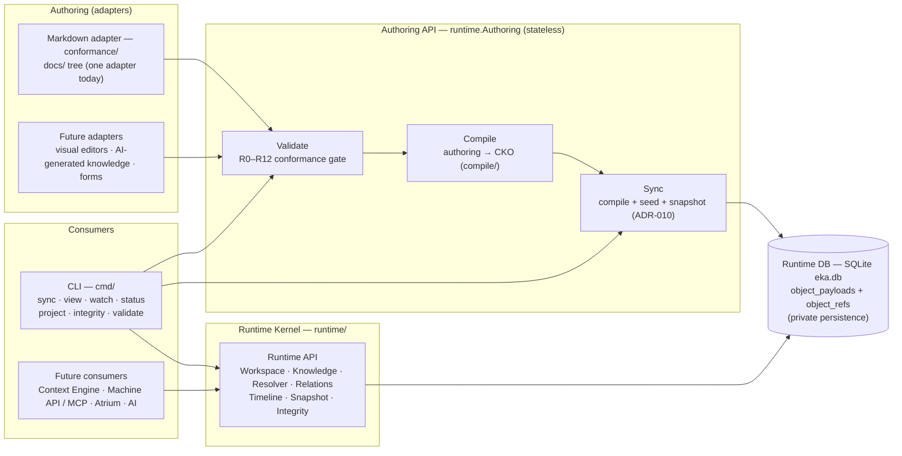

# Runtime API — EKA Knowledge Runtime v0.2.0

> Convention document, not an artifact (no `type`/`id`). Documents the **Runtime Kernel** of the v0.2.0 Runtime: the internal **Runtime API** and the **Authoring API** — the one sanctioned entry point every consumer talks to.
> Authoritative decision: [ADR-014](decisions/adr-014-runtime-interface-architecture.md) (the interface architecture). Companion documents: [`runtime-architecture.md`](runtime-architecture.md) (the runtime these APIs expose), [`cko-specification.md`](cko-specification.md) (the Canonical Knowledge Object these APIs return), [`cli.md`](cli.md) (the CLI, the first consumer). This document explains the contracts; ADR-014 is normative.
> Terminology status: the names *runtime*, *workspace*, *snapshot*, and *sync* are **not finalized** — a future milestone may rename them. Everything here is experimental.

## 1. Purpose

The **Runtime Kernel** (package `runtime/`) is the single sanctioned entry point of the EKA Knowledge Runtime. Every consumer — the CLI today; the Context Engine, the Machine-readable API, MCP, Atrium tomorrow — communicates with the runtime through these service contracts, never through storage internals (ADR-014 §Context). Why the Kernel exists:

- **One sanctioned way in.** Consumers learn the knowledge-shaped contract once — never SQLite tables, resolver semantics, provenance rules, or the integrity contract.
- **Future components build on the same contracts.** The CKO-shaped API is the shared vocabulary the future set reserved (ADR-012 §Decision 7, ADR-013 §Consequences); ADR-014 §Future Extensibility names the consumers.
- **Enforcement is structural, not conventional.** The isolation is checkable mechanically by the import graph (`go list` / an import linter); a violation is a visible architectural error.

The Kernel exposes two APIs:

- **The Runtime API** — seven services over the workspace and the canonical store: **Workspace, Knowledge, Resolver, Relations, Timeline, Snapshot, Integrity**. It is Engineering-Knowledge-shaped, not CRUD/storage-shaped: the services return domain types — `exchange.Unit` (the CKO), `exchange.Package`, reports — and aggregate state (`Workspace.Status`); they never return table rows, `*sql.DB` handles, or storage keys. The Runtime API **never understands Markdown**: no file paths, no frontmatter, no docs tree — those live only behind the authoring adapter (ADR-014 §Decision 2).
- **The Authoring API** — the stateless gateway from authoring representations into Canonical Knowledge Objects and runtime state: `AuthoringService` with `Validate`, `Compile`, `Sync`, exposed as the package-level variable `runtime.Authoring`. It produces only CKO and reports; it never exposes database implementation details (ADR-014 §Decision 3).

Both APIs are **internal, in-process contracts**: package/service method calls on **concrete types** — deliberately not Go interface types (no consumer needs polymorphism yet; interfaces are introduced when a consumer actually requires them), and deliberately not HTTP/RPC/REST/gRPC (one process, one binary).

## 2. Data flow



Reading the flow: **authoring representations** (Markdown today, via the conformance adapter; future adapters) enter through the **Authoring API** — `Validate` gates them, `Compile` turns them into Canonical Knowledge Objects, `Sync` seeds the canonical store (compile + seed + snapshot write, the explicit synchronization of ADR-010). The **Runtime API** services read that store — the only store access in the system — and serve **consumers**: the CLI delegates its runtime commands to the services; future consumers (Context Engine, Machine API/MCP, Atrium, AI) build on the same contracts. The Runtime DB is private: no consumer, present or future, touches it directly.

## 3. The Runtime API

### 3.1 Entry points

| Call | Contract |
|---|---|
| `runtime.Ensure()` | open the Runtime at the workspace root, initializing the workspace when missing; idempotent; wires every service |
| `runtime.Open()` | open an EXISTING workspace, never initializing one — read-style entry (the `eka status` probe); a missing workspace returns the **detached state** (`Exists() == false`; every service call errors deterministically) |
| `Close()` / `Path()` / `Exists()` | close the store / resolve the workspace root / report whether the workspace is initialized |

### 3.2 Services and operations

| Service | Operation | Contract (one line) | Returns |
|---|---|---|---|
| Workspace | `RegisterRepo(path, name)` | register a repository under a project; re-registration is a no-op (path refreshed); the first project owns the path | `Project`, `Repo`, `created` bool |
| Workspace | `FindRepo(absPath)` | resolve a normalized absolute path to its registered repository | `Repo`, found bool |
| Workspace | `Repos(projectID)` | every repository of one project, **sorted by name** | `[]Repo` |
| Workspace | `Projects()` | every registered project, **sorted by id** | `[]Project` |
| Workspace | `LastSync(projectID, repo)` | the most recent sync-log entry of one repository (newest pull or push) | `*SyncEntry`, found bool |
| Workspace | `Status()` | the aggregated workspace overview — path, schema version, id, created, per-project repository bullets with their last sync, store totals; **one call, one consistent snapshot**, deterministic order | `*WorkspaceStatus` |
| Knowledge | `Object(form)` | one CKO by canonical identity form (`<ns>/<type>:<id>:<v>`) | `*exchange.Unit` (CKO), found bool |
| Knowledge | `UnitsByProject(projectID)` | the **project union** — the projection source of the Runtime; decoded from immutable payloads, **sorted by canonical form** | `[]*exchange.Unit` |
| Knowledge | `Units(projectID, sourceRepo)` | one repository's units (its provenance pair); **sorted by canonical form** | `[]*exchange.Unit` |
| Knowledge | `Search(query)` | exact-match filter over the project's units — identity tuple (namespace/type/id) and the index columns (dimension/domain/phase); project required; **sorted by canonical form**; no partial/prefix matching in this milestone | `[]*exchange.Unit` |
| Knowledge | `Counts()` | store totals: objects (references — the current objects of the immutable model), immutable payloads, attachments | ints |
| Resolver | `Resolve(form)` | one reference to its current unit — canonical form (exact instance) or qualified line form (`<ns>/<type>:<id>`, the lowest instance-version); unqualified forms are rejected (the Runtime resolves globally, no referrer context) | `*exchange.Unit`, found bool |
| Resolver | `ResolveLine(ns, type, id)` | every instance of one artifact line, **sorted by instance-version ascending (history order)** | `[]*exchange.Unit` |
| Relations | `From(form)` | the outgoing relationships of one unit, in (type, target) order; a nonexistent identity is an **error**, never a silent empty list | `[]Relation` |
| Relations | `To(target)` | every incoming relationship pointing at the target, **workspace-wide** (each returned edge's target is the referring unit's canonical form) | `[]Relation` |
| Relations | `Upstream(form)` | the outgoing targets resolved to units; **sorted by canonical form**, deduplicated, draft-tolerant (unresolvable targets skipped, never errors) | `[]*exchange.Unit` |
| Relations | `Downstream(form)` | the incoming referrers resolved to units; **sorted by canonical form**, deduplicated, draft-tolerant | `[]*exchange.Unit` |
| Timeline | `Line(ns, type, id)` | one identity line's history — form, instance version, revision, object hash, change log in occurrence order; **sorted by instance-version**; an empty line returns an empty slice | `[]TimelineEntry` |
| Snapshot | `Read(path)` | open and byte-exact verify an RSF package (`.ekapkg` or directory layout) — structure, strict JSON, SHA-256 integrity, manifest self-consistency; any failure is `*exchange.PackageError`; read-only (writing happens through `Authoring.Sync`, push side) | `*exchange.Package` |
| Integrity | `Verify()` | the full store integrity scan — payload hashes, payload decode, reference targets + derived index columns, attachment digests, registry; read-only; violations **sorted by (kind, subject)**; unreferenced payloads counted as history, never violations | `*IntegrityReport` |
| Integrity | `SchemaVersion()` | the canonical store schema version (eka.db) | int |

### 3.3 Return types and determinism

- **The unit of the Runtime is the CKO.** `exchange.Unit` — decoded from the immutable payloads, digest-tagged (each unit carries the `object_hash` of the payload it was decoded from). Reports and registry records are the internal packages' contract types, re-exported: `ValidationReport = conformance.Report`, `CompileResult = compile.Result`, `SyncResult = sync.Report`, `SyncOptions = sync.Options`, `ValidationError = compile.ValidationError`, `IntegrityReport = store.IntegrityReport`, `Project`/`Repo` = `workspace.*`, `SyncEntry = store.SyncEntry` (ADR-014 §Consequences: the alias re-exports are accepted as contract types — the reports are the domain-shaped return values).
- **Determinism.** Every collection is deterministically ordered: units by canonical form, lines by instance-version, registries by id/name, violations by (kind, subject). Identical synced store state → identical results.
- **Scan-based trade-offs (v0.2, documented).** `Relations.To` / `Relations.Downstream` iterate every project (sorted by id) and every unit (sorted by canonical form) and filter in memory — the honest cost of a workspace-wide reverse index, and the point of the Runtime: consumers never hand-walk relationships. `Knowledge.Search` filters in memory over `UnitsByProject` (one SQL read, then deterministic filtering); the `object_refs` index columns (`dimension`, `domain`, `phase`, identity tuple) exist but search does not push the filter into SQL yet. Both are deterministic and fine at runtime scale; indexed SQL is reserved as a later optimization (ADR-014 §Consequences).
- **Failure discipline.** A detached Runtime (Open on a missing workspace) errors deterministically on every service call. `Relations.From` on a nonexistent identity is an error — the consumer asked about an object that is not there. Traversal skips unresolvable targets (draft tolerance, R5), never errors.

## 4. The Authoring API

The Authoring API is the **stateless** gateway from authoring representations into the runtime: a zero-size service value (`runtime.Authoring`, package-level), synchronous, with no database handle and no runtime state — `Sync` receives the opened `*Runtime` explicitly. **Markdown is one authoring adapter** (the conformance package's `Scan`/`analyzeFile`) behind it; future adapters — visual editors, AI-generated knowledge, forms, VS Code extensions, Atrium — enter through the same API and inherit validation, compilation and integrity verification (ADR-014 §Decision 3).

| Operation | Contract | Returns |
|---|---|---|
| `Validate(root)` | the authoring conformance gate (R0–R12) over the repository at `root`; read-only; findings are carried in the report (`Pass() == false` for blocking violations) — Validate always returns a report, never a validation error | `*ValidationReport` (`conformance.Report`) |
| `Compile(root)` | authoring → CKO **via the Knowledge Compiler** (`compile/`): the conformance gate, then the package assembled exactly as a repository-scope export would; the compiler never writes to disk; a gate failure is refused with `*ValidationError` (the caller renders the report) | `*CompileResult` (`compile.Result`) |
| `Sync(rt, repoPath, opts)` | the explicit synchronization of ADR-010: resolve and (auto-)register the repository, then pull and/or push per `opts` — **compile + seed the canonical store + snapshot write**; idempotent, `sync_log` recorded; typed error classes preserved — `*ValidationError` (docs gate) and `*exchange.PackageError` (corrupt snapshot) map to the validation and integrity failure classes | `*SyncResult` (`sync.Report`) |

The Authoring API produces **only CKO and reports**: no table rows, no file writes outside the sync path, no database details. It is the API `eka validate` (Validate), the docs-mode sync / `--from-docs` re-seed (Compile + Sync) and the full sync cycle (Sync) all delegate to.

## 5. Storage isolation

SQLite (`store/`) is a **private persistence implementation** of the Runtime Kernel (ADR-014 §Decision 4):

- The `store/`, `workspace/`, `sync/` and `compile/` packages are **internal to the Kernel**: production code outside `runtime/` must not import them. The CLI no longer does; nothing else may.
- The persistence handle — `workspace.Store()` (the accessor replacing the previously exported `Workspace.DB` field) — is **Kernel-internal**: no package outside `runtime/` touches it, and the raw `*sql.DB` exposure (`store.Store.DB()`) is withdrawn from non-Kernel use.
- **Tests may use `store`/`workspace` directly** for seeding and corruption fixtures — testing the integrity detector requires corrupting the store. Test-only, documented.
- External consumers — the CLI, and future Context Engine / Machine API / MCP / Atrium — use the services only.
- The rule is enforced **structurally** (the import graph), not by documentation: a violation is a visible architectural error.
- Consequence: future storage engines are replaceable without changing any consumer; SQLite being "persistence only" (ADR-011) now has the structural boundary it was missing (ADR-014 §Consequences).

## 6. Package organization

The Kernel gives each concern one layer, with one-way dependencies and no cycles (ADR-014 §Decision 6):

```
Domain Model     exchange/      CKO + RSF
Adapters         conformance/   Markdown adapter + ontology helpers (authoring)
                 bootstrap/     repository generation
Compiler         compile/       Knowledge Compiler
Persistence      store/         SQLite canonical store (private to the Kernel)
Runtime Services runtime/       the Kernel (+ sync/ orchestration beneath the Authoring API)
Renderer         view/ + cmd/ui projection rendering
CLI (consumer)   cmd/           client of the runtime services
```

Dependency rule:

```
runtime → {store, workspace, sync, compile, conformance (helpers), exchange}
cmd     → {runtime, exchange, view, conformance (types), bootstrap, ui}
```

Nothing outside `runtime/` imports `store/`, `workspace/`, `sync/` or `compile/` in production code. `eka init` stays the authoring adapter (bootstrap/ repo generation); `eka export` / `eka import` stay exchange transport operations — they touch repository files and packages, never the runtime store.

## 7. Future integrations (NOT implemented — boundaries only)

The Kernel's contracts are the boundaries the future set builds on; none of the following exist yet (ADR-014 §Future Extensibility):

- **Context Engine** — `Knowledge.Search` + `Relations` traversal are its query surface; it builds on the Kernel without learning storage.
- **Machine-readable API / MCP** — CKO serialization over the same services; a thin adapter, exactly as ADR-011 §Decision 8 reserved.
- **Atrium** — the projection source (`Knowledge.UnitsByProject`) + the resolver (`Resolver.Resolve` / `Resolver.ResolveLine`) are the read path it needs.
- **Alternative authoring** — visual editors, AI-generated knowledge, forms: the Authoring API (Validate/Compile/Sync), inheriting validation, compilation and integrity verification.
- **Semantic / vector search** — a separate capability behind the `Knowledge.Search` boundaries, not a new storage contract.
- **Storage engine replacement** — `store/` behind the Kernel; the swap is a Kernel-internal change.

## 8. References

- [ADR-014 — Runtime Interface Architecture](decisions/adr-014-runtime-interface-architecture.md) — the authoritative decision record for everything in this document (context, decisions, consequences, alternatives, future extensibility)
- [ADR-013 — Store-Backed Projections](decisions/adr-013-store-backed-projections.md) — the store read path the Knowledge service wraps; the refusal messages and empty-projection notes are pinned CLI behavior the Kernel preserves
- [ADR-012 — Canonical Knowledge Object Runtime](decisions/adr-012-canonical-knowledge-object-runtime.md) — the CKO (`exchange.Unit`) the Runtime API returns; the compiler gateway is the Authoring API's engine
- [ADR-011 — Immutable Engineering Knowledge Model](decisions/adr-011-immutable-engineering-knowledge-model.md) — the immutable store behind the Kernel; the integrity scan is the Integrity service's contract
- [ADR-010 — Synchronization Model](decisions/adr-010-synchronization-model.md) — the explicit synchronization `Authoring.Sync` realizes
- [`runtime-architecture.md`](runtime-architecture.md) — the runtime these APIs expose (workspace, canonical store, sync protocol, CLI behavior review, roadmap)
- [`cko-specification.md`](cko-specification.md) — the Canonical Knowledge Object schema (field reference, derived values, integrity, Runtime Contract)
- [`cli.md`](cli.md) — the CLI, the first consumer of the Kernel: command → service delegation, output and exit codes
- [`adr-summary.md`](adr-summary.md) — index of the 14 Implementation ADRs
- The implementation: [`../../runtime/`](../../runtime/) — `runtime.go` (entry points, service wiring), `workspace.go`, `knowledge.go`, `resolver.go`, `relations.go`, `timeline.go`, `snapshot.go`, `integrity.go`, `authoring.go`
